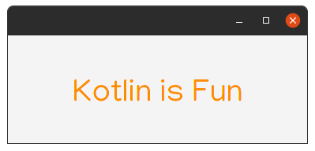
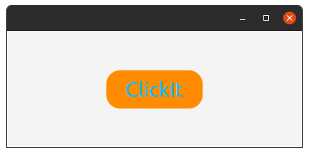
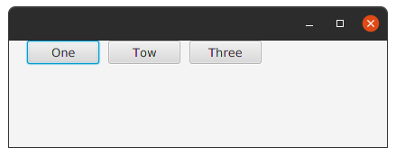
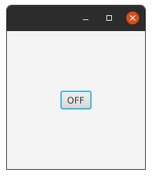
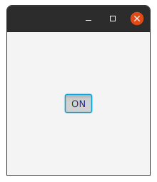
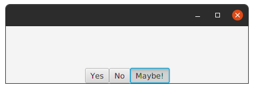

Label.
-----
Label is a non-editable text control.
A Label is useful for displaying text that is required to fit within a specific space, and thus may need to use an ellipsis or truncation to size the string to fit.
Labels also are useful in that they can have mnemonics which, if used, will send focus to the Control listed as the target of the labelFor property.

Extensions | Property | Description
 -----     | ----     | ------
`labelFor`  |  `labelForProperty()` | ...

**Example**:
```kotlin
   class MainView: View() {
    override val root = borderpane {
        center {
            label("Kotlin is Fun").style {
                fontSize=40.px
                fontFamily="Manjari"
                textFill= Color.DARKORANGE
            }
        }
    }
}
```
_Note_: I used style in the example, but you'll see more details later about style and css in tornadofx.

**Output**:



Button.
-----
A simple button control.
The button control can contain text and/or a graphic.

Extensions |      Property | Description
  -----     |       ----     | ------
`isDefaultButton` | `cancelButtonProperty()` | A default Button is the button that receives a keyboard `VK_ENTER` press, if no other node in the scene consumes it.
`isCancelButton` | `defaultButtonProperty()` | A Cancel Button is the button that receives a keyboard `VK_ESC` press, if no other node in the scene consumes it.

**Example**:
```kotlin
class MainView: View() {
    override val root = borderpane {
        center{
            button("Click_It"){
                style{
                    fontSize=30.px
                    fontFamily="Ubuntu"
                    textFill=Color.DEEPSKYBLUE
                    backgroundColor+=Color.DARKORANGE
                    backgroundRadius+= CssBox(20.px,20.px,20.px,20.px)
                }
                action {
                    this@MainView.close()
                }
            }
        }
    }
}
```
**Output**:



ButtonBar.
-------

A `ButtonBar` is essentially a `HBox`, with the additional functionality for operating system specific button placement.
In other words, any `Node` may be annotated (via the setButtonData(`Node`, `ButtonBar.ButtonData`) method, placed inside a `ButtonBar` (via the `getButtons()` list),
and will then be positioned relative to all other nodes in the button list based on their annotations, as well as the overarching button order specified for the `ButtonBar`.
Uniform button sizing

Extensions |      Property | Description
  -----     |       ----     | ------
`buttonMinWidth` | `buttonMinWidthProperty()`  | **Returns** the minimum width of all buttons placed in this button bar.
`buttonOrder` | `buttonOrderProperty()` | **Returns** the current button order.
`buttons` |  Yes | **Returns**: A list containing all buttons currently in the button bar, and allowing for further buttons to be added or removed.
`button()` | No  | A Simple Button.

**Example**:

```kotlin
class MainView: View() {
    override val root = pane{
        buttonbar(buttonOrder = BUTTON_ORDER_LINUX){
            buttonMinWidth = 80.0
            button("One")
            button("Tow")
            button("Three")
        }
    }
}
```
**Output:**



ToggleButton.
-----------

A `ToggleButton` is a button that expresses a `true/false` state depending on its selection state.

**Example**:

```kotlin
class MainView: View() {
    override val root = borderpane{
        setPrefSize(200.0,200.0)
        center = togglebutton {
            textProperty().bind(selectedProperty().stringBinding {
                if (it == true) "ON" else "OFF"
            })
        }
    }
}
```
**Output**:

 

ToggleGroup.
----------

class which contains a reference to all Toggles whose selected variables should be managed such that only a single Toggle within the ToggleGroup may be selected at any one time.
Generally ToggleGroups are managed automatically simply by specifying the name of a ToggleGroup on the Toggle, but in some situations it is desirable to explicitly manage which ToggleGroup is used by Toggles.

Extensions    |    Property   |  Description
  -----       |    -------    | ------
`properties`  |      Yes       | **Returns** an observable map of properties on this node for use primarily by application developers.
`selectedToggle` | `selectedToggleProperty()` | **Returns**:Toggle The selected toggle.
`toggles` |      Yes      | The list of toggles within the `ToggleGroup`.
`userData` |     No     | **Returns** a previously set Object property, or `null` if no such property has been set using the `setUserData(Object)` method.
`hasProperties()` |    No    | **Returns**:`true` if node has properties.
`selectToggle()` |    No    | **Params**:value – The Toggle that is to be selected.
`bind()` |    No    |  ...
No    | `selectedValueProperty<>()` | ...

**Example**:

```kotlin
class MainView:View() {
    override val root = hbox {
        alignment = Pos.BOTTOM_CENTER
        togglegroup {
            togglebutton("Yes", this)
            togglebutton("No", this)
            togglebutton("Maybe!", this)
        }
    }
}
```
**Output**:

