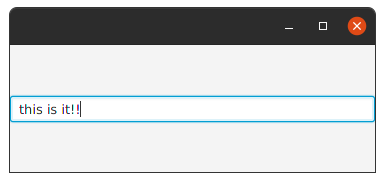

Label.
-----
Label is a non-editable text control.
A Label is useful for displaying text that is required to fit within a specific space, and thus may need to use an ellipsis or truncation to size the string to fit.
Labels also are useful in that they can have mnemonics which, if used, will send focus to the Control listed as the target of the labelFor property.

Extensions | Property | Description
 -----     | ----     | ------
`labelFor`  |  `labelForProperty()` | ...

**Example**:
```kotlin
   class MainView: View() {
    override val root = borderpane {
        center {
            label("Kotlin is Fun").style {
                fontSize=40.px
                fontFamily="Manjari"
                textFill= Color.DARKORANGE
            }
        }
    }
}
```
_Note_: I used style in the example, but you'll see more details later about style and css in tornadofx.

**Output**:


Button.
-----
A simple button control.
The button control can contain text and/or a graphic.

Extensions |      Property | Description
  -----     |       ----     | ------
`isDefaultButton` | `cancelButtonProperty()` | A default Button is the button that receives a keyboard `VK_ENTER` press, if no other node in the scene consumes it.
`isCancelButton` | `defaultButtonProperty()` | A Cancel Button is the button that receives a keyboard `VK_ESC` press, if no other node in the scene consumes it.

**Example**:
```kotlin
class MainView: View() {
    override val root = borderpane {
        center{
            button("Click_It"){
                style{
                    fontSize=30.px
                    fontFamily="Ubuntu"
                    textFill=Color.DEEPSKYBLUE
                    backgroundColor+=Color.DARKORANGE
                    backgroundRadius+= CssBox(20.px,20.px,20.px,20.px)
                }
                action {
                    this@MainView.close()
                }
            }
        }
    }
}
```
**Output**:


ButtonBar.
-------

A `ButtonBar` is essentially a `HBox`, with the additional functionality for operating system specific button placement.
In other words, any `Node` may be annotated (via the setButtonData(`Node`, `ButtonBar.ButtonData`) method, placed inside a `ButtonBar` (via the `getButtons()` list),
and will then be positioned relative to all other nodes in the button list based on their annotations, as well as the overarching button order specified for the `ButtonBar`.
Uniform button sizing

Extensions |      Property | Description
  -----     |       ----     | ------
`buttonMinWidth` | `buttonMinWidthProperty()`  | **Returns** the minimum width of all buttons placed in this button bar.
`buttonOrder` | `buttonOrderProperty()` | **Returns** the current button order.
`buttons` |  Yes | **Returns**: A list containing all buttons currently in the button bar, and allowing for further buttons to be added or removed.
`button()` | No  | A Simple Button.

**Example**:

```kotlin
class MainView: View() {
    override val root = pane{
        buttonbar(buttonOrder = BUTTON_ORDER_LINUX){
            buttonMinWidth = 80.0
            button("One")
            button("Tow")
            button("Three")
        }
    }
}
```
**Output:**


ToggleButton.
-----------

A `ToggleButton` is a button that expresses a `true/false` state depending on its selection state.

**Example**:

```kotlin
class MainView: View() {
    override val root = borderpane{
        setPrefSize(200.0,200.0)
        center = togglebutton {
            textProperty().bind(selectedProperty().stringBinding {
                if (it == true) "ON" else "OFF"
            })
        }
    }
}
```
**Output**:

 

ToggleGroup.
----------

class which contains a reference to all Toggles whose selected variables should be managed such that only a single Toggle within the ToggleGroup may be selected at any one time.
Generally ToggleGroups are managed automatically simply by specifying the name of a ToggleGroup on the Toggle, but in some situations it is desirable to explicitly manage which ToggleGroup is used by Toggles.

Extensions    |    Property   |  Description
  -----       |    -------    | ------
`properties`  |      Yes       | **Returns** an observable map of properties on this node for use primarily by application developers.
`selectedToggle` | `selectedToggleProperty()` | **Returns**:Toggle The selected toggle.
`toggles` |      Yes      | The list of toggles within the `ToggleGroup`.
`userData` |     No     | **Returns** a previously set Object property, or `null` if no such property has been set using the `setUserData(Object)` method.
`hasProperties()` |    No    | **Returns**:`true` if node has properties.
`selectToggle()` |    No    | **Params**:value – The Toggle that is to be selected.
`bind()` |    No    |  ...
No    | `selectedValueProperty<>()` | ...

**Example**:

```kotlin
class MainView:View() {
    override val root = hbox {
        alignment = Pos.BOTTOM_CENTER
        togglegroup {
            togglebutton("Yes", this)
            togglebutton("No", this)
            togglebutton("Maybe!", this)
        }
    }
}
```
**Output**:


Text.
-----

The Text class defines a node that displays a text.
Paragraphs are separated by `\n` and the text is wrapped on paragraph boundaries.

Extensions    |    Property   |  Description
  -----       |    -------    | ------
`text` | `textProperty()` | Defines text string that is to be displayed.
`textOrigin` | `textOriginProperty()` | Defines the origin of text coordinate system in local coordinates. _Note_: in case multiple rows are rendered `VPos.BASELINE` and `VPos.TOP` define the origin of the top row while `VPos.BOTTOM` defines the origin of the bottom row.
`textAlignment` | `textAlignmentProperty()` | Defines horizontal text alignment in the bounding box. The width of the bounding box is defined by the widest row. _Note_: In the case of a single line of text, where the width of the node is determined by the width of the text, the alignment setting has no effect.
`font` | `fontProperty()` | Defines the font of text.
`fontSmoothingType`  | `fontSmoothingTypeProperty()` | Specifies a requested font smoothing type : `gray` or `LCD`. The width of the bounding box is defined by the widest row. Note: LCD mode doesn't apply in numerous cases, such as various compositing modes, where effects are applied and very large glyphs.
`boundsType` | `boundsTypeProperty()` | Determines how the bounds of the text node are calculated. Logical bounds is a more appropriate default for text than the visual bounds. See TextBoundsType for more information.
`isStrikethrough` | `strikethroughProperty()` | Defines if each line of text should have a line through it.
`isUnderline` | `underlineProperty()` | Defines if each line of text should have a line below it.
`lineSpacing` | `lineSpacingProperty()` | Defines the vertical space in pixel between lines.
`baselineOffset` | `baselineOffsetProperty()` | The 'alphabetic' (or roman) baseline offset from the Text node's layoutBounds.minY location. The value typically corresponds to the max ascent of the font.
`wrappingWidth` | `wrappingWidthProperty()` | Defines a width constraint for the text in user space coordinates, e.g. pixels, not glyph or character count. If the value is > 0 text will be line wrapped as needed to satisfy this constraint.
`x` | `xProperty()` | Defines the X coordinate of text origin.
`y` | `yProperty()` | Defines the Y coordinate of text origin.
**Example**:

```kotlin
class MainView: View() {
    override val root = hbox {
        text {
            text = "Kotlin + TornadoFx is Fun"
            this.font = Font("Manjari", 30.0)
        }
    }
}
```
**Output**:


TextFlow.
-------

TextFlow is special layout designed to lay out rich text. 
It can be used to layout several Text nodes in a single text flow. 
The TextFlow uses the `text` and the `font` of each Text node inside of it plus it own width and text alignment to determine the location for each child.
A single Text node can span over several lines due to wrapping and the visual location of Text node can differ from the logical location due to bidi reordering.

Extensions    |    Property   |  Description
  -----       |    -------    | ------
`lineSpacing` | `lineSpacingProperty()` | Defines the vertical space in pixel between lines.
`textAlignment` | `textAlignmentProperty()` | Defines horizontal text alignment

**Example**:

```kotlin
class MainView:View() {
    override val root = pane {
        textflow {
            text("S").style{fontSize=33.px; fill= Color.LIGHTBLUE}
            text("omething ").style{fontSize=26.px; fill= Color.DARKORANGE}
            text("L").style{fontSize=33.px; fill= Color.LIGHTBLUE}
            text("ike this").style{fontSize=26.px; fill= Color.DARKORANGE}
        }
    }
}
```
**Output**:


TextArea.
-------

Text input component that allows a user to enter multiple lines of plain text.
Unlike in previous releases of **JavaFX**, support for single line input is not available as part of the TextArea control, 
however this is the sole-purpose of the TextField control.

Extensions    |    Property   |  Description
  -----       |    -------    | ------
`isWrapText` | `wrapTextProperty()` | If a run of text exceeds the width of the TextArea, then this variable indicates whether the text should wrap onto another line.
`paragraphs`| Yes | **Returns** an unmodifiable list of the character sequences that back the text area's content.
`prefColumnCount` | `prefColumnCountProperty()` |The preferred number of text columns. This is used for calculating the TextArea's preferred width.
`prefRowCount` | `prefRowCountProperty()` | The preferred number of text rows. This is used for calculating the TextArea's preferred height.
`scrollLeft` | `scrollLeftProperty()` | The number of pixels by which the content is horizontally scrolled.
`scrollTop` | `scrollTopProperty()` | The number of pixels by which the content is vertically scrolled.

**Example**:

```kotlin
class MainView: View() {
    override val root = hbox {
        textarea(str) {
            isWrapText=true
            font = Font("Manjari",25.0)
        }
    }
}
```
**Output**:


TextField.
--------

Text input component that allows a user to enter a single line of unformatted text. 
Unlike in previous releases of **JavaFX**, support for multi-line input is not available as part of the TextField control,

Extensions    |    Property   |  Description
  -------     |    -------    |   --------
`alignment` | `alignmentProperty()` | Specifies how the text should be aligned when there is empty space within the TextField.
`characters` | No | **Returns** the character sequence backing the text field's content.
`onAction` | `onActionProperty()` | The action handler associated with this text field, or null if no action handler is assigned. The action handler is normally called when the user types the **ENTER** key.
`prefColumnCount` | `prefColumnCountProperty()` | The preferred number of text columns. This is used for calculating the TextField's preferred width.

**Example**:
```kotlin
class MainView: View() {
    override val root = borderpane {
        center = textfield {
            onAction= EventHandler { println(this.characters) }
        }
    }
}
```
**Output**:



And when you press Enter key will get in **condole**:

`this is it!!`

PasswordField.
-----------

Text field that masks entered characters.

**Example**:

```kotlin
class MainView:View() {
    override val root = borderpane {
        center = passwordfield {
            onAction= EventHandler { println(this.characters) }
        }
    }
}
```

**Output**:


And when you press Enter key will get in **condole**:

`password!!`

FieldSet.
-------

Extensions    |    Property   |  Description
  -------     |    -------    |   --------
`text` | `textProperty()` | 
`form` | No | ...
`icon` | `iconProperty()` | ...
`inputGrow` | `inputGrowProperty()` | Enumeration used to determine the grow (or shrink) priority of a given node's layout area when its region has more (or less) space available and multiple nodes are competing for that space. _more detailes below_
`labelPosition` | `labelPositionProperty()` | Orientation: `HORIZONTAL` right <-> left orientation, `VERTICAL` top <-> bottom orientation
`legend` | `legendProperty` | ... 

**see also:**

Priority can be :
* `ALWAYS` Layout area will always try to grow (or shrink), sharing the increase (or decrease) in space with other layout areas that have a grow (or shrink) of ALWAYS.
* `SOMETIMES` If there are no other layout areas with grow (or shrink) set to ALWAYS or those layout areas didn't absorb all of the increased (or decreased) space, then will share the increase (or decrease) in space with other layout area's of SOMETIMES.
* `NEVER` Layout area will never grow (or shrink) when there is an increase (or decrease) in space available in the region.

**Example:**

```kotlin
class MainView: View() {
    override val root = form {
        fieldset {
            text = "Sign in"
            this.legend = label("Please fill you the fields below.")
            field {
                textfield { promptText="Enter your name" }
            }
            field {
                passwordfield { promptText="Enter your pass" }
            }
        }
    }
}
```

**Output:**


Combobox.
-------

An implementation of the `ComboBoxBase` abstract class for the most common form of `ComboBox`,
where a popup list is shown to users providing them with a choice that they may select from.
For more information around the general concepts and **API** of `ComboBox`, refer to the `ComboBoxBase` class documentation.
On top of `ComboBoxBase`, the `ComboBox` class introduces additional **API**.
Most importantly, it adds an items property that works in much the same way as the ListView items property.
In other words, it is the content of the items list that is displayed to users when they click on the ComboBox button.
The `ComboBox` exposes the `valueProperty()` from `ComboBoxBase`, but there are some important points of the value property that need to be understood in relation to `ComboBox`.
These include:
* The value property is not constrained to items contained within the items list - it can be anything as long as it is a valid value of type `T`.
* If the value property is set to a non-null object, and subsequently the items list is cleared, the value property is not nulled out.
* Clearing the selection in the selection model does not null the value property - it remains the same as before.
* It is valid for the selection model to have a selection set to a given index even if there are no items in the list (or less items in the list than the given index).
Once the items list is further populated, such that the list contains enough items to have an item in the given index,
both the selection model `SelectionModel.selectedItemProperty()` and value property will be updated to have this value.
This is inconsistent with other controls that use a selection model, but done intentionally for `ComboBox`.

Extensions    |    Property   |  Description
  -------     |    -------    |   --------
`buttonCell` | `buttonCellProperty()` | The button cell is used to render what is shown in the ComboBox `'button'` area. If a cell is set here.
`cellFactory` | `cellFactoryProperty()` | Providing a custom cell factory allows for complete customization of the rendering of items in the ComboBox. Refer to the Cell javadoc for more information on cell factories.
`converter` | `converterProperty()` | Converts the user-typed input (when the ComboBox is editable) to an object of type `T`, such that the input may be retrieved via the value property.
`editor` | `editorProperty()` | The `editor` for the ComboBox. The editor is null if the ComboBox is not editable.
`items` | `itemsProperty()` | The list of items to show within the ComboBox popup.
`placeholder` | `placeholderProperty()` | This `Node` is shown to the user when the ComboBox has no content to show. The `placeholder` node is shown in the ComboBox popup area when the items list is null or empty.
`selectionModel` | `selectionModelProperty()` | The selection model for the ComboBox. A ComboBox only supports single selection.
`visibleRowCount` | `visibleRowCountProperty()` | The maximum number of rows to be visible in the ComboBox popup when it is showing. By default this value is `10`.
`selectedItem`| No | **Return** the index of the item that selected.
`valueSelections`| No | ...
`asyncItems { }` | No | ...
`makeAutocompletable()` | No | ...
`cellFormat { }` | No | ...

**Example:**

```kotlin
class MainView: View() {
    val list = listOf("Austin",
        "Dallas","Midland", "San Antonio","Fort Worth").observable()
    override val root = vbox {
        combobox<String> {
            items = list
        }
    }
}
```

**Output:**


ListView.
-------

A ListView displays a horizontal or vertical list of items from which the user may select,
or with which the user may interact.
A `ListView` is able to have its generic type set to represent the type of data in the backing model.
Doing this has the benefit of making various methods in the `ListView`, as well as the supporting classes (mentioned below), type-safe.
In addition, making use of the generic supports substantially simplifies development of applications making use of `ListView`,
as all modern IDEs are able to auto-complete far more successfully with the additional type information.
Populating a `ListView`

Extensions    |    Property   |  Description
  -------     |    -------    |   --------
`cellFactory` | `cellFactoryProperty()` | Sets a new cell factory to use in the `ListView`. This forces all old ListCell's to be thrown away, and new ListCell's created with the new cell factory.
`editingIndex` | `editingIndexProperty()` | **Returns** the index of the item currently being edited in the ListView, or -1 if no item is being edited.
`edit()` | No | Instructs the `ListView` to begin editing the item in the given index, if the `ListView` is editable. Once this method is called, if the current `cellFactoryProperty()` is set up to support editing, the Cell will switch its visual state to enable for user input to take place. **Params**:itemIndex – The index of the item in the `ListView` that should be edited.
`fixedCellSize` | `fixedCellSizeProperty()` | **Returns** the fixed cell size value. A value less than or equal to zero is used to represent that fixed cell size mode is disabled, and a value greater than zero represents the size of all cells in this control.
`focusModel` | `focusModelProperty()` | **Returns** the currently installed FocusModel.
`isEditable` | `editableProperty()` | Specifies whether this `ListView` is editable - only if the ListView and the ListCells within it are both editable will a ListCell be able to go into their editing state.
`items` | `itemsProperty()` | **Returns** an ObservableList that contains the items currently being shown to the user. This may be null if setItems(ObservableList) has previously been called, however, by default it is an empty ObservableList.
`itemSelections` | No | ...
`onEditCancel` | `onEditCancelProperty()` | **Returns** the EventHandler that will be called when the user cancels an edit.
`onEdit()` | No | ...
`onEditStart` | `onEditStartProperty()` | **Returns** the EventHandler that will be called when the user begins an edit, **Also** `setOnEditStart{}`:Sets the EventHandler that will be called when the user begins an edit.
`onEditCommit` | `onEditCommitProperty()` | **Returns** the EventHandler that will be called when the user commits an edit, **Also** `setOnEditCommit{}`:Sets the EventHandler that will be called when the user has completed their editing.
`onEditCancel` | `onEditCancelProperty()` | **Returns** the EventHandler that will be called when the user cancels an edit, **Also** `setOnEditCancel{}`:Sets the EventHandler that will be called when the user cancels an edit.
`onScrollTo` | `onScrollToProperty()` | Called when there's a request to scroll an index into view using scrollTo(int) or scrollTo(Object), **Also** `setOnScrollTo{}`:Sets the EventHandler that will be called when the user scrolling.
`scrollTo()` | No | Scrolls the `ListView` such that the item in the given index is visible to the end user, **Params**:index – The index that should be made visible to the user, assuming of course that it is greater than, or equal to `0`, and less than the size of the items list contained within the given `ListView`.
`refresh()` | No | Calling `refresh()` forces the `ListView` control to recreate and repopulate the cells necessary to populate the visual bounds of the control. In other words, this forces the ListView to update what it is showing to the user. This is useful in cases where the underlying data source has changed in a way that is not observed by the `ListView` itself.
`selectedItem` | No |
`useCheckbox{}` | No | ...
`asyncItems{}` | No |  ... 
`bindSelected()` | No |  ... 
`cellCache{}` | No |  ... 
`cellFormat{}` | No |  ... 
`multiSelect()` | No |  ... 
`onUserDelete{}` | No |  ... 
`onUserSelect{}` | No |  ... 
`selectWhere{}` | No |  ... 

**Example:**

```kotlin
class MainView: View() {
    val cal = ('A'..'Z').toList().observable()
    override val root = vbox {
        listview<Char> {
            items = cal
        }
    }
}
```

**Output:**


ListMenu.
-------

Extensions    |    Property   |  Description
  -------     |    -------    |   --------
`item{...}` | No | ...
`items` | Yes | ...
`activeItem` | `activeItemProperty` | ...
`theme` | `themeProperty` | ...
`graphicFixedSized` | `graphicFixedSizeProperty` | ...
`iconPosition` | `iconPositionProperty` | ...
`orientation` | `orientationProperty` | ...

`item()` Extensions    |   `item()` Property   | `item()` Description
  -------              |    -------           |   --------
`active` | `activeProperty` | ...
`graphic` | `graphicProperty` | ...
`text` | `textProperty` | ...
`needsLayout()` | No | ...
`whenSelected{}` | No | ...

**Example:**

```kotlin
class MainView: View() {
    val str = listOf("First", "Second", "Third", "Fourth", "Fifth")
    override val root = vbox {
        listmenu {
            str.forEach {
                item(it) {
                    whenSelected {
                        println("$text is active now.")
                    }
                }
            }
        }
    }
}
```

**Output:**


when the item is selected the console output:

`Third is active now.`

MenuBar.
------

A MenuBar control traditionally is placed at the very top of the user interface, and embedded within it are Menus. 
To add a menu to a `menubar`, you add it to the menus `ObservableList`. 
By default, for each menu added to the `menubar`, it will be represented as a button with the Menu text value displayed.

Extensions    |    Property   |  Description
  -------     |    -------    |   --------
`isUseSystemMenuBar` | `useSystemMenuBarProperty()` | Use the system menu bar if the current platform supports it. This should not be set on more than one MenuBar instance per Stage. If this property is set to true on more than one MenuBar in the same Stage, then the behavior is undefined.
`menus` | No | The menus to show within this MenuBar. If this ObservableList is modified at runtime, the MenuBar will update as expected.
`menu{...}` | No | ...

`menu()` Extensions    |   `menu()` Property   | `menu()` Description
  -------     |    -------    |   --------
`isShowing` | No | Indicates whether the ContextMenu is currently visible.
`items` | No | The items to show within this menu. If this `ObservableList` is modified at runtime, the Menu will update as expected.
`onHidden` | `onHiddenProperty()` | Called just after the ContextMenu has been hidden, **Also** `setOnHidden{}`
`onHiding` | `onHidingProperty()` | Called just prior to the ContextMenu being hidden, **Also** `setOnHiding{}`
`onShown` | `onShownProperty()` | Called just after the ContextMenu is shown, **Also** `setOnShown{}`
`onShowing` | `onShowingProperty()` | Called just prior to the ContextMenu being shown, even if the menu has no items to show. _Note_ however that this won't be called if the menu does not have a valid anchor node, **Also** `setOnShowing{}`
`hide()` | No | Hides the ContextMenu if it was previously showing, and any showing submenus. If this menu is not showing, then invoking this function has no effect.
`show()` | No | If the Menu is not disabled and the ContextMenu is not already showing, then this will cause the ContextMenu to be shown.
`item(){...}` | No | ...
`checkmenuitem(){...}` | No | ...
`radiomenuitem()` | No | ...
`customitem()` | No | ...
`separator()` | No | ...

`item()` Extensions    |   `item()` Property   | `item()` Description
-------     |    -------    |   --------
`accelerator` | `acceleratorProperty()` | The accelerator property enables accessing the associated action in one keystroke. It is a convenience offered to perform quickly a given action.
`graphic` | `graphicProperty()` | An optional graphic for the MenuItem. This will normally be an javafx.scene.image.ImageView node, but there is no requirement for this to be the case.
`isDisable` | `disableProperty()` | Setting disable to true will cause this MenuItem to become disabled.
`disableWhen{}` | No | ...
`isMnemonicParsing` | `mnemonicParsingProperty()` | MnemonicParsing property to enable/disable text parsing. If this is set to true, then the MenuItem text will be parsed to see if it contains the mnemonic parsing
`isVisible` | `visibleProperty()` | Specifies whether this MenuItem should be rendered as part of the scene graph.
`visibleWhen{}` | No | ...
`onAction` | `onActionProperty()` | The action, which is invoked whenever the MenuItem is fired. This may be due to the user clicking on the button with the mouse, or by a touch event, or by a key press, or if the developer programatically invokes the `fire()` method, Also `setOnAction{}`
`action{}`  | No | ...
`actionEvents()` | No | ...
`addEventHandler`() | No | Registers an event handler to this MenuItem. The handler is called when the menu item receives an Event of the specified type during the bubbling phase of event delivery.
`onMenuValidation` | `onMenuValidationProperty()` | The event handler that is associated with invocation of an accelerator for a MenuItem. This can happen when a key sequence for an accelerator is pressed. The event handler is also invoked when onShowing event handler is called, Also `setOnMenuValidation{}`
`enableWhen{}` | No | ...
`parentMenu` | `parentMenuProperty()` | This is the Menu in which this MenuItem exists. It is possible for an instance of this class to not have a parentMenu - this means that this instance is either:
                                      |* Not yet associated with its parentMenu.
                                      |* A 'root' Menu (i.e. it is a context menu, attached directly to a MenuBar, MenuButton, or any of the other controls that use Menu internally.
`parentPopup` | `parentPopupProperty()` | This is the ContextMenu in which this MenuItem exists.
`properties` | Yes |**Returns** an observable map of properties on this menu item for use primarily by application developers.
                   |**Returns:** an observable map of properties on this menu item for use primarily by application developers
`text` | `textProperty()` | The text to display in the MenuItem.
`userData` | No |**Returns** a previously set Object property, or null if no such property has been set using the `setUserData(Object)` method.
                |**Returns:** The Object that was previously set, or null if no property has been set or if null was set.
                |**Params:**
                |* eventType – the type of the events to receive by the handler
                |* eventHandler – the handler to register
`fire()` | No | Fires a new ActionEvent.
No |`styleProperty()` | A string representation of the **CSS** style associated with this specific MenuItem. This is analogous to the `"style"` attribute of an **HTML** element.
`command` | `commandProperty` | ...
`commandParameter` | `commandParameterProperty` | ...

`checkmenuitem()` Extensions    |   `checkmenuitem()` Property   | `checkmenuitem()` Description
  -------                       |    -------                     |   --------
`isSelected` | `selectedProperty()` | Represents the current state of this CheckMenuItem. Bind to this to be informed whenever the user interacts with the CheckMenuItem (and causes the selected state to be toggled).


`customitem()` Extensions    |   `customitem()` Property   | `customitem()` Description
  -------                       |    -------                     |   --------
`content` | `contentProperty()` | The node to display within this CustomMenuItem.
`isHideOnClick` | `hideOnClickProperty()` | If true, this menu item, and all visible menus, will be hidden when this menu item is clicked on.

`separator()` Extensions    |   `separator()` Property   | `separator()` Description
  -------                       |    -------                     |   --------
`orientation` | `orientationProperty()` | The orientation of the Separator can either be horizontal or vertical.
`halignment` | `halignmentProperty()` | For vertical separators, specifies the horizontal position of the separator line within the separator control's space. Ignored for horizontal separators.
`valignment` | `valignmentProperty()` | For horizontal separators, specifies the vertical alignment of the separator line within the separator control's space. Ignored for vertical separators.

**Example:**
```kotlin
class MainView: View() {
    override val root = vbox {
        menubar {
            listOf("File", "Edit", "View", "Build", "Help").forEach {
                menu(it) {
                    when (it) {
                        "View" -> this.isDisable = true
                        "File" -> listOf("New", "Open", "Setting", "Save All", "Exit").forEach { item -> item(item) }
                        "Edit" -> listOf("Cut", "Copy", "Paste", "Delete", "Find").forEach { item -> item(item) }
                        "Build" -> listOf("Build P", "Build M", "Recompile", "Rebuild").forEach { item -> item(item) }
                        "Help" -> listOf("Help", "Check Update", "About").forEach { item -> item(item) }
                    }
                }
            }
        }
    }
}
```

**Output:**

