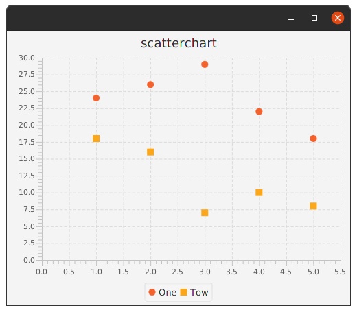
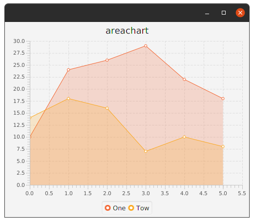
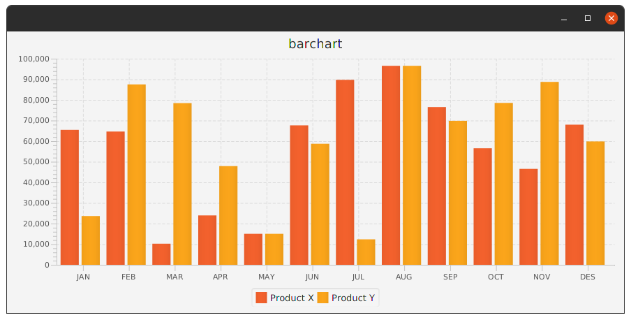
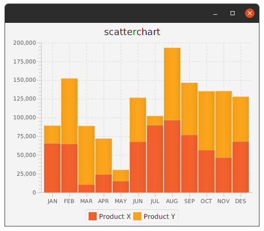
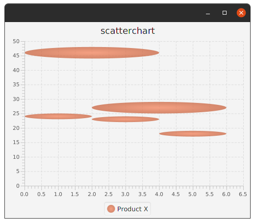
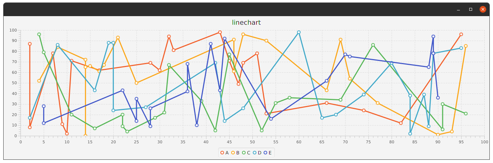
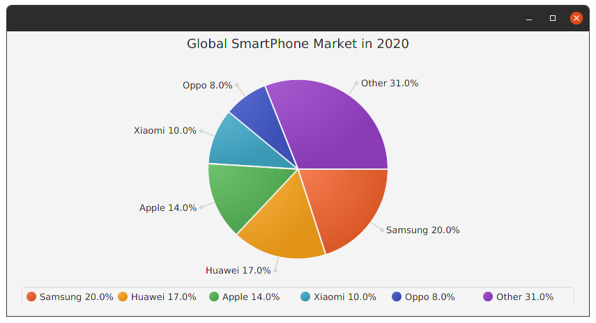

ScatterChart.
------------

Chart type that plots symbols for the data points in a `series`.
```kotlin
        scatterchart("scatterchart", NumberAxis(), NumberAxis())
```
* **Params:** 
  * title - The Title of this Chart.
  * xAxis – The x-axis to use.
  * yAxis – The y-axis to use.

**series{}**

Extensions    |    Property   |  Description
-------     |    -------    |   --------
`data` | `dataProperty()` | `ObservableList` of data items that make up this `series`
`chart` | `chartProperty()` | Reference to the chart this `series` belongs to
`name` | `nameProperty()` | The user displayable name for this `series`
`node` | `nodeProperty()` | The node to display for this series. This is created by the chart if it uses nodes to represent the whole series. For example line chart uses this for the line but scatter chart does not use it. This node will be set as soon as the series is added to the chart. You can then get it to add mouse listeners etc.

## `data{}` Extensions. 

Extensions    |    Property   |  Description
-------     |    -------    |   --------
`xValue` | No | The generic data value to be plotted on the `X` axis
`yValue` | No | The generic data value to be plotted on the `Y` axis
`extraValue` | `extraValueProperty()` | The generic data value to be plotted in any way the chart needs. For example used as the radius for `BubbleChart`.
`node` | `nodeProperty()` | The node to display for this data item. You can either create your own node and set it on the data item before you add the item to the chart. Otherwise the chart will create a node for you that has the default representation for the chart type. This node will be set as soon as the data is added to the chart. You can then get it to add mouse listeners etc. Charts will do their best to position and size the node appropriately, for example on a Line or Scatter chart this node will be positioned centered on the data values position. For a bar chart this is positioned and resized as the bar for this data item.

**Example:**

```kotlin
class MainView:View() {
    override val root = vbox {
      scatterchart("scatterchart", NumberAxis(), NumberAxis()) {
        series("One") {
          data(1, 24)
          data(2, 26)
          data(3, 29)
          data(4, 22)
          data(5, 18)
        }
        series("Tow") {
          data(1, 18)
          data(2, 16)
          data(3, 7)
          data(4, 10)
          data(5, 8)
        }
      }
    }
}
```

**Output:**



AreaChart.
---------
*********

AreaChart - Plots the area between the line that connects the data points, and the `0` line on the `Y` axis.

Extensions    |    Property   |  Description
-------     |    -------    |   --------
`createSymbols` | `createSymbolsProperty()` | Indicates whether symbols for data points will be created or not.

**Example:**

```kotlin
class MainView:View() {
    override val root = vbox {
      areachart("areachart", NumberAxis(), NumberAxis()) {
        series("One") {
          data(0, 10)
          data(1, 24)
          data(2, 26)
          data(3, 29)
          data(4, 22)
          data(5, 18)
        }
        series("Tow") {
          data(0, 14)
          data(1, 18)
          data(2, 16)
          data(3, 7)
          data(4, 10)
          data(5, 8)
        }
      }
    }
}
```

**Output:**



BarChart.
-------
*******

A chart that plots bars indicating data values for a category. 
The bars can be vertical or horizontal depending on which axis is a category axis.

Extensions    |    Property   |  Description
-------     |    -------    |   --------
`barGap` | `barGapproperty()` | The gap to leave between bars in the same category
`categoryGap` | `categoryGapproperty()` | The gap to leave between bars in separate categories

**Example:**

```kotlin
class MainView:View() {
    override val root = vbox {
      barchart("scatterchart", CategoryAxis(), NumberAxis()) {
        categoryGap = 1.5
        series("Product X") {
          data("JAN",65486);data("FEB",64654);data("MAR", 10245)
          data("APR", 23963);data("MAY", 15038);data("JUN",67657)
          data("JUL",89746);data("AUG",96545);data("SEP",76546)
          data("OCT",56546);data("NOV",46545);data("DES",67986)
        }
        series("Product Y") {
          data("JAN",23659);data("FEB",87521);data("MAR", 78456)
          data("APR", 47885);data("MAY", 15038);data("JUN",58741)
          data("JUL",12365);data("AUG",96545);data("SEP",69863)
          data("OCT",78547);data("NOV",88745);data("DES",59861)
        }
      }
    }
}
```

**Output:**



StackedBarChart.
---------------
***************

StackedBarChart is a variation of BarChart that plots bars indicating data values for a category.
The bars can be vertical or horizontal depending on which axis is a category axis. 
The bar for each series is stacked on top of the previous series.

**Example:**

```kotlin
class MainView:View() {
    override val root = vbox {
      stackedbarchart("stackedbarchart", CategoryAxis(), NumberAxis()) {
        /*
        the same barchart data
        */
      }
    }
}
```

**Output:**



BubbleChart.
----------
**********

Chart type that plots bubbles for the data points in a series.
The extra value property of Data is used to represent the radius of the bubble it should be a `java.lang.Number`.

**Example:**

```kotlin
class MainView:View() {
    override val root = vbox {
      bubblechart("bubblechart", NumberAxis(), NumberAxis()) {
        series("Product X") {
          data(1,24,1)
          data(2,46,2)
          data(3,23,1)
          data(4,27,2)
          data(5,18,1)
        }
      }
    }
}
```
**Output:**



LineChart.
---------
*********

Line Chart plots a line connecting the data points in a series.
The data points themselves can be represented by symbols optionally. 
Line charts are usually used to view data trends over time or category.

Extensions    |    Property   |  Description
-------     |    -------    |   --------
`axisSortingPolicy` | `axisSortingPolicyProperty()` | Indicates whether the data passed to `LineChart` should be sorted by natural order of one of the axes. If this is set to `LineChart.SortingPolicy.NONE`, the order in `dataProperty()` will be used.
`createSymbols` | `createSymbolsProperty()` | Indicates whether symbols for data points will be created or not.

**Example:**

```kotlin
class MainView:View() {
  override val root = vbox {
    linechart("linechart", NumberAxis(), NumberAxis()) {
      axisSortingPolicy
      ('A'..'E').forEach {
        series(it.toString()) {
          (0..20).forEach {
            data(Random.nextInt(0, 100), Random.nextInt(0, 100))
          }
        }
      }
    }
  }
}
```
_Note: I Show you in this example how the linechart looks like not all this not real sample._

**Output:**



PieChart.
--------
********

Displays a PieChart. 
The chart content is populated by pie slices based on data set on the PieChart.
The `clockwise` property is set to `true` by default, which means slices are placed in the clockwise order. 
The `labelsVisible` property is used to either display pie slice labels or not.

Extensions    |    Property   |  Description
-------     |    -------    |   --------
`data` | `dataProperty()` | 
`isClockwise` | `clockwiseProperty()` | When `true` we start placing slices clockwise from the startAngle
`labelLineLength` | `labelLineLengthProperty()` | The length of the line from the outside of the pie to the slice labels.
`labelsVisible` | `labelsVisibleProperty()` | Indicates whether pie slice labels are drawn or not
`startAngle` | `startAngleProperty()` | The angle to start the first pie slice at

**Example:**

```kotlin
class MainView:View() {
    override val root = vbox {
      piechart("Global SmartPhone Market in 2020") {
        mapOf(
          "Samsung" to 20.0,
          "Huawei" to 17.0,
          "Apple" to 14.0,
          "Xiaomi" to 10.0,
          "Oppo" to 8.0,
          "Other" to 31.0
        ).forEach { (name, value) ->
          data("$name $value%",value)
        }
      }
    }
}
```

**Output:**


