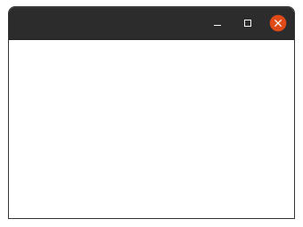
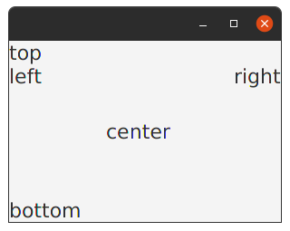
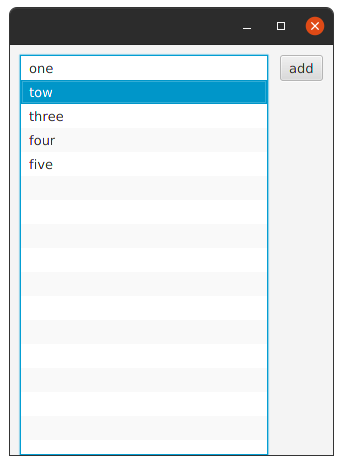
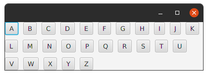
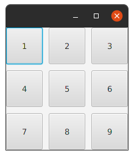
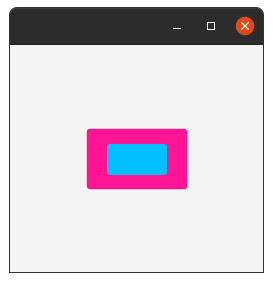
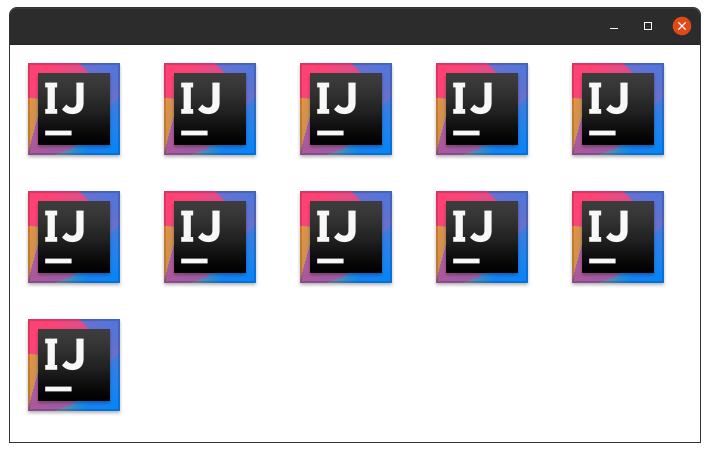
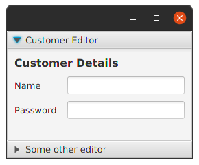
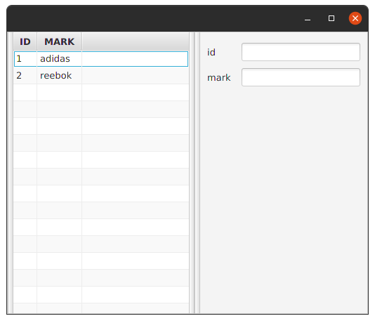

Pane.
----

Base class for layout panes which need to expose the children list as public so that users of the subclass can freely add/remove children.

**Example:**

```kotlin
class MainView:View(){
    override val root = pane{
    }
}
```

**Output:**



BorderPane.
----------
*********

Extensions    |    Property   |  Description
-------     |    -------    |   --------
`top` | `topProperty()` | The node placed on the **top** edge of this border pane. If resizable, it will be resized to its preferred height and it's width will span the width of the border pane. If the node cannot be resized to fill the top space (it's not resizable or its max size prevents it) then it will be aligned top-left within the space unless the child's alignment constraint has been set.
`bottom` | `bottomProperty()` | The node placed on the **bottom** edge of this border pane. If resizable, it will be resized to its preferred height and it's width will span the width of the border pane. If the node cannot be resized to fill the bottom space (it's not resizable or its max size prevents it) then it will be aligned bottom-left within the space unless the child's alignment constraint has been set.
`right` | `rightProperty()` | The node placed on the **right** edge of this border pane. If resizable, it will be resized to its preferred width and it's height will span the height of the border pane between the top and bottom nodes. If the node cannot be resized to fill the right space (it's not resizable or its max size prevents it) then it will be aligned top-right within the space unless the child's alignment constraint has been set.
`left` | `leftProperty()` | The node placed on the **left** edge of this border pane. If resizable, it will be resized to its preferred width and it's height will span the height of the border pane between the top and bottom nodes. If the node cannot be resized to fill the left space (it's not resizable or its max size prevents it) then it will be aligned top-left within the space unless the child's alignment constraint has been set.
`center` | `centerProperty()` | The node placed in the **center** of this border pane. If resizable, it will be resized fill the center of the border pane between the top, bottom, left, and right nodes. If the node cannot be resized to fill the center space (it's not resizable or its max size prevents it) then it will be center aligned unless the child's alignment constraint has been set.

**Example:**

```kotlin
class MainView:View() {
    override val root = borderpane {
        setPrefSize(300.0, 200.0)
        top {
            label("top").font = Font(22.0)
        }
        left {
            label("left").font = Font(22.0)
        }
        right {
            label("right").font = Font(22.0)
        }
        bottom {
            label("bottom").font = Font(22.0)
        }
        center {
            label("center").font = Font(22.0)
        }
    }
}
```

**Output:**



AnchorPane.
----------
*********

AnchorPane allows the edges of child nodes to be anchored to an offset from the anchor pane's edges.
If the anchor pane has a border and/or padding set, the offsets will be measured from the inside edge of those insets.
```kotlin
class MainView:View() {
    override val root = pane {
        val ap = anchorpane()

        // List should stretch as anchorPane is resized
        val list = listview(listOf("one","tow","three","four","five").observable())
        AnchorPane.setTopAnchor(list, 10.0)
        AnchorPane.setLeftAnchor(list, 10.0)
        AnchorPane.setRightAnchor(list, 65.0)

        // Button will float on right edge
        val button = button("add")
        AnchorPane.setTopAnchor(button, 10.0)
        AnchorPane.setRightAnchor(button, 10.0)
        ap.children.addAll(list, button)
    }
}
```

**Output:**



FlowPane lays out its children in a flow that wraps at the flowpane's boundary.
A horizontal `flowpane` (the default) will layout nodes in rows, wrapping at the flowpane's width.
A vertical `flowpane` lays out nodes in columns, wrapping at the flowpane's height.
If the `flowpane` has a border and/or padding set, the content will be flowed within those insets.

Extensions    |    Property   |  Description
-------     |    -------    |   --------
`alignment` | `alignmentProperty()` | The overall alignment of the flowpane's content within its width and height. For a horizontal `flowpane`, each row will be aligned within the flowpane's width using the alignment's hpos value, and the rows will be aligned within the flowpane's height using the alignment's `vpos` value. For a vertical `flowpane`, each column will be aligned within the flowpane's height using the alignment's `vpos` value, and the columns will be aligned within the flowpane's width using the alignment's `hpos` value.
`hgap` | `hgapProperty()` | The amount of horizontal space between each node in a horizontal `flowpane` or the space between columns in a vertical `flowpane`.
`vgap` | `vgapProperty()` | The amount of vertical space between each node in a vertical `flowpane` or the space between rows in a horizontal `flowpane`.
`orientation` | `orientationProperty()` | The orientation of this `flowpane`. A horizontal `flowpane` lays out children left to right, wrapping at the flowpane's width boundary. A vertical `flowpane` lays out children top to bottom, wrapping at the flowpane's height. The default is horizontal.
`rowValignment` | `rowValignmentProperty()` | The vertical alignment of nodes within each row of a horizontal `flowpane`. If this property is set to `VPos.BASELINE`, then the `flowpane` will always resize children to their preferred heights, rather than expanding heights to fill the row height. The property is ignored for vertical flowpanes.
`prefWrapLength` | `prefWrapLengthProperty()` | The preferred width where content should wrap in a horizontal `flowpane` or the preferred height where content should wrap in a vertical `flowpane`. This value is used only to compute the preferred size of the `flowpane` and may not reflect the actual width or height, which may change if the flowpane is resized to something other than its preferred size. Applications should initialize this value to define a reasonable span for wrapping the content.
`columnHalignment` | `columnHalignmentProperty()` | The horizontal alignment of nodes within each column of a vertical `flowpane`. The property is ignored for horizontal `flowpanes`.

**Example:**

```kotlin
 class MainView: View() {
    override val root = flowpane {
        this.hgap=10.0
        this.vgap=10.0
        this.orientation=Orientation.HORIZONTAL
        ('A'..'Z').forEach {
            button(it.toString())
        }
    }
}
```

**Output:**



GridPane.
-------
*******

GridPane lays out its children within a flexible grid of rows and columns. 
If a border and/or padding is set, then its content will be layed out within those insets.

Extensions    |    Property   |  Description
-------     |    -------    |   --------
`hgap` | `hgapProperty()` | The `width` of the horizontal gaps between columns.
`vgap` | `vgapProperty()` | The `height` of the vertical gaps between rows.
`alignment` | `alignmentProperty()` | The `alignment` of of the grid within the gridpane's `width` and `height`.
`rowConstraints` | Yes | **Returns** list of `row` constraints. Row constraints can be added to explicitly control individual `row` sizing and `layout` behavior. If not set, `row` sizing and `layout` behavior is computed based on content. Index in the `ObservableList` denotes the `row` number, so the `row` constraint for the first `row` is at the position of `0`.
`columnConstraints` | Yes | **Returns** list of `column` constraints. Column constraints can be added to explicitly control individual `column` sizing and layout behavior. If not set, `column` sizing and `layout` behavior is computed based on content. Index in the `ObservableList` denotes the column number, so the `column` constraint for the first `column` is at the position of `0`.
`isGridLinesVisible` | `gridLinesVisibleProperty()` | *For debug purposes only:* controls whether lines are displayed to show the gridpane's rows and columns. Default is `false`.
`row{}` | No | ...
`addRow()` | No | Convenience method for placing the specified nodes sequentially in a given row of the `gridpane`. If the `row` already contains nodes the specified nodes will be appended to the `row`. For example, the first node will be positioned at [column,row], the second at [column+1,row], etc. This method will set the appropriate `gridpane row/column` constraints on the nodes as well as add the nodes to the gridpane's `children` sequence. **Params:** *rowIndex* – the row index position for the `children` within the `gridpane`, *children* – the nodes to be added as a row in the `gridpane`
`addColumn()` | No | Convenience method for placing the specified nodes sequentially in a given column of the `gridpane`. If the `column` already contains nodes the specified nodes will be appended to the `column`. For example, the first node will be positioned at [column, row], the second at [column, row+1], etc. This method will set the appropriate `gridpane row/column` constraints on the nodes as well as add the nodes to the gridpane's `children` sequence. **Params:** *columnIndex* – the column index position for the `children` within the `gridpane` *children* – the nodes to be added as a `column` in the `gridpane`
`constraintsForColumn()` & `constraintsForRow()`| No | Defines optional `layout` constraints for a `column` & `row` in a `GridPane`. If a `ColumnConstraints` object is added for a `column` & `row` in a `gridpane`, the `gridpane` will use those constraint values when computing the column's/row's `width` and `layout`.

**Example:**

```kotlin
class MainView: View() {
    override val root = gridpane {
        vgap=10.0 ; hgap=10.0
        arrayListOf("123","456","789").forEach {
            row{
                it.forEach {
                    button(it.toString()) {
                        style{
                            setPrefSize(60.0,60.0)
                        }
                    }
                }
            }
        }
    }
}
```

**Output:**



StackPane lays out its children in a back-to-front stack.
The z-order of the children is defined by the order of the children list with the 0th child being the bottom and last child on top. If a border and/or padding have been set, the children will be layed out within those insets.

Extensions    |    Property   |  Description
-------     |    -------    |   --------
`alignment` |`alignmentProperty()` | The default `alignment` of children within the stackpane's width and height. This may be overridden on individual `children` by setting the child's `alignment` constraint.
`content` | `contentProperty()` | ...
`contentUiComponent<>()` | No | ...
`creatable` | No | ...
`onCreate()` | No | ...
`deletable` | No | ...
`onDelete()` | No | ...
`refreshable` | No | ...
`onRefresh()` | No | ...
`savable` | No | ...
`onSave()` | No | ...

**Example:**

```kotlin
class MainView: View() {
    override val root = stackpane {
        button {
            setPrefSize(100.0,60.0)
            style{backgroundColor.plusAssign(Color.DEEPPINK)}
        }
        button {
            setPrefSize(60.0,30.0)
            style{backgroundColor.plusAssign(Color.DEEPSKYBLUE)}
        }
    }
}
```
**Output:**



_This not button inside button but button over button._

TilePane.
-------
******

TilePane lays out its children in a grid of uniformly sized `"tiles"`.
A horizontal `tilepane` (the default) will tile nodes in rows, wrapping at the tilepane's `width`.
A vertical `tilepane` will tile nodes in columns, wrapping at the tilepane's `height`.

Extensions    |    Property   |  Description
-------     |    -------    |   --------
`hgap` | `hgapProperty()` | The amount of horizontal space between each tile in a `row`.
`vgap` | `vgapProperty()` | The amount of vertical space between each tile in a `column`.
`prefRows` | `prefRowsProperty()` | The preferred number of rows for a vertical `tilepane`. This value is used only to compute the preferred size of the `tilepane` and may not reflect the actual number of rows, which may change if the `tilepane` is resized to something other than its preferred `height`.
`prefColumns` | `prefColumnsProperty()` | The preferred number of columns for a horizontal `tilepane`. This value is used only to compute the preferred size of the `tilepane` and may not reflect the actual number of rows, which may change if the `tilepane` is resized to something other than its preferred `height`.
`alignment` | `alignmentProperty()` | The overall `alignment` of the tilepane's content within its `width` and `height`. For a **horizontal** `tilepane`, each row will be aligned within the tilepane's width using the alignment's hpos value, and the rows will be aligned within the tilepane's height using the alignment's `vpos` value. For a **vertical** `tilepane`, each `column` will be aligned within the tilepane's `height` using the alignment's `vpos` value, and the columns will be aligned within the tilepane's width using the alignment's `hpos` value.
`orientation` | `orientationProperty()` | The orientation of this `tilepane`. A horizontal `tilepane` lays out `children` in tiles, left to right, wrapping tiles at the tilepane's width boundary. A vertical `tilepane` lays out children in tiles, `top` to `bottom`, wrapping at the tilepane's `height`. The default is horizontal.
`prefTileHeight` | `prefTileHeightProperty()` | The preferred `height` of each tile. If equal to `USE_COMPUTED_SIZE` (the default) the tile `height` will be automatically recomputed by the `tilepane` when the preferred size of `children` changes to accommodate the tallest child.
`prefTileWidth` | `prefTileWidthProperty()` | The preferred `height` of each tile. If equal to `USE_COMPUTED_SIZE` (the default) the tile height will be automatically recomputed by the `tilepane` when the preferred size of `children` changes to accommodate the tallest child.
`tileAlignment` | `tileAlignmentProperty()` | The default `alignment` of each child within its tile. This may be overridden on individual `children` by setting the child's `alignment` constraint.
`tileHeight` | `tileHeightProperty()` | The actual `height` of each tile. This property is read-only.
`tileWidth` | `tileWidthProperty()` | The actual `width` of each tile. This property is read-only.

**Example:**

```kotlin
class MainView: View() {
    override val root = tilepane {
        hgap=8.0
        prefColumns=4
        (0..10).forEach {
            imageview(Paths.get("idea.png").toUri().toURL().toString())
        }
    }
}
```

**Output:**



TitledPane.
---------
*********

A TitledPane is a panel with a title that can be opened and closed.
The panel in a `TitledPane` can be any **Node** such as UI controls or groups of nodes added to a layout container.

Extensions    |    Property   |  Description
-------     |    -------    |   --------
`content` | `contentProperty()` | The content of the `TitledPane`. Null is returned when if there is no content.
`isAnimated` | `animatedProperty()` | **Returns** the animated state of the `TitledPane`.
`isCollapsible` | `collapsibleProperty()` | **Returns** the collapsible state of the `TitlePane`.
`isExpanded` | `expandedProperty()` | **Returns** the expanded state of the `TitledPane`.

**Example:**

```kotlin
class MainView: View() {
    override val root = vbox {
        titledpane("Customer Editor") {
            form {
                fieldset("Customer Details") {
                    field("Name") { textfield() }
                    field("Password") { textfield() }
                }
            }
        }
        titledpane("Some other editor") {
            isAnimated=false ; isExpanded=false
            stackpane {
                label("Nothing here")
            }
        }
    }
}   
```

**Output:**



ScrollPane.
---------
*********

A Control that provides a scrolled, clipped viewport of its contents. It allows the user to scroll the content around either directly (panning) or by using scroll bars. 
The `ScrollPane` allows specification of the scroll bar policy, which determines when scroll bars are displayed: **always**, **never**, or **only** when they are needed. 
The scroll bar policy can be specified independently for the horizontal and vertical scroll bars.
The `ScrollPane` allows the application to set the current, `minimum`, and `maximum` values for positioning the contents in the horizontal and vertical directions. 
These values are mapped proportionally onto the `layoutBounds` of the contained node.

Extensions    |    Property   |  Description
-------     |    -------    |   --------
`content` | `contentProperty()` | The node used as the content of this `ScrollPane`.
`hbarPolicy` | `hbarPolicyProperty()` | Specifies the policy for showing the horizontal scroll bar.
`vbarPolicy` | `vbarPolicyProperty()` | Specifies the policy for showing the vertical scroll bar.
`hmax` | `hmaxProperty()` | The `maximum` allowable `hvalue` for this `ScrollPane`. Default value is `1`.
`hmin` | `hminProperty()` | The `minimum` allowable `hvalue` for this `ScrollPane`. Default value is `0`.
`vmax` | `vmaxProperty()` | The `maximum` allowable `vvalue` for this `ScrollPane`. Default value is `1`.
`vmin` | `vminProperty()` | The `minimum` allowable `vvalue` for this `ScrollPane`. Default value is `0`.
`hvalue` | `hvalueProperty()` | The current horizontal scroll position of the `ScrollPane`. This value may be set by the application to scroll the view programatically.
`vvalue` | `vvalueProperty()` | The current vertical scroll position of the `ScrollPane`. This value may be set by the application to scroll the view programatically.
`minViewportHeight` | `minViewportHeightProperty()` | Specify the minimum `height` of the `ScrollPane` Viewport. This is the `height` that will be available to the content node.
`minViewportWidth` | `minViewportWidthProperty()` | Specify the minimum `width` of the `ScrollPane` Viewport. This is the `width` that will be available to the content node.
`prefViewportHeight` | `prefViewportHeightProperty()` | Specify the preferred `height` of the `ScrollPane` Viewport. This is the `height` that will be available to the content node. The overall `height` of the `ScrollPane` is the `ViewportHeight + padding`
`prefViewportWidth` | `prefViewportWidthProperty()` | Specify the perferred `width` of the `ScrollPane` Viewport. This is the `width` that will be available to the content node. The overall `width` of the `ScrollPane` is the `ViewportWidth + padding`
`isFitToHeight` | No | If true and if the contained node is a Resizable, then the node will be kept resized to match the `height` of the ScrollPane's viewport. If the contained node is not a Resizable, this value is ignored.
`isFitToWidth` | No | if true and if the contained node is a Resizable, then the node will be kept resized to match the `width` of the ScrollPane's viewport. If the contained node is not a Resizable, this value is ignored.
`isPannable` | No | Specifies whether the user should be able to pan the viewport by using the mouse. If mouse events reach the `ScrollPane` (that is, if mouse events are not blocked by the contained node or one of its children) then pannable is consulted to determine if the events should be used for panning.
`viewportBounds` | `viewportBoundsProperty()` | The actual `Bounds` of the` ScrollPane` Viewport. This is the `Bounds` of the content node.

###viewportBounds.block

Extensions    |    Property   |  Description
-------     |    -------    |   --------
`height` | No | The `height` of this Bounds.
`width` | No | The `width` of this Bounds.
`depth` | No | The `depth` of this Bounds.
`maxX` | No | The `x` coordinate of the lower-right corner of this Bounds.
`maxY` | No | The `y` coordinate of the lower-right corner of this Bounds.
`maxZ` | No | The maximum `z` coordinate of this Bounds.
`minX` | No | The `x` coordinate of the upper-left corner of this Bounds.
`minY` | No | The `y` coordinate of the upper-left corner of this Bounds.
`minZ` | No | The minimum `z` coordinate of this Bounds.
`isEmpty` | No | **Returns:** `true` if any of the dimensions(`width`, `height` or `depth`) of this bounds is less than zero.
`contains()` | No | Tests if the interior of this `Bounds` entirely contains the specified rectangular area.
`intersects()` | No | **Returns:** `true` if the interior of this Bounds and the interior of the rectangular area intersect.

**Example:**

```kotlin
class MainView: View() {
    override val root = scrollpane {
        imageview(Paths.get("Tornado.jpg").toUri().toURL().toString())
    }
}
```

SplitPane.
--------
********

A control that has two or more sides, each separated by a divider, which can be dragged by the user to give more space to one of the sides, resulting in the other side shrinking by an equal amount.
Nodes can be positioned horizontally next to each other, or stacked vertically.
This can be controlled by setting the `orientationProperty()`.
The dividers in a `SplitPane` have the following behavior
* Dividers cannot overlap another divider
* Dividers cannot overlap a node.
* Dividers moving to the `left/top` will stop when the node's min size is reached.
* Dividers moving to the `right/bottom` will stop when the node's max size is reached.

Extensions    |    Property   |  Description
-------     |    -------    |   --------
`dividerPositions` | No | **Returns:** an array of double containing the position of each divider.
`dividers` | Yes | **Returns** an unmodifiable list of all the dividers in this `SplitPane`.
`items` | Yes | **Returns** an `ObservableList` which can be use to modify the contents of the `SplitPane`. The order the nodes are placed into this list will be the same order in the `SplitPane`.
`orientation` | `orientationProperty()` | The orientation for the `SplitPane`.
`setDividerPosition()` | No | Sets the position of the divider at the specified divider index. **Params:** `dividerIndex` – the index of the divider. `position` – the divider position, between `0.0` and `1.0` (inclusive).
`setDividerPositions()` | No | Sets the position of the divider, **Params:** `positions` – the divider position, between `0.0` and `1.0` (inclusive).

**Example:**

```kotlin
class MainView: View() {
    val list = listOf(Main(1,"adidas"),Main(2,"reebok")).observable()
    override val root = splitpane {
        items.add(tableview(list){
            readonlyColumn("ID",Main::id)
            readonlyColumn("MARK",Main::mark)
        })
        items.add(form {
            fieldset(""){
                field("id") {textfield {  }}
                field("mark") {textfield {  }}
            }
        })
    }
}
class Main (val id:Int,val mark:String)
```

**Output:**



A control that allows switching between a group of Tabs. 
Only one tab is visible at a time.
Tabs are added to the TabPane by using the getTabs.
Tabs in a `TabPane` can be positioned at any of the four sides by specifying the Side.
A `TabPane` has two modes floating or recessed. 
Applying the `styleclass` `STYLE_CLASS_FLOATING` will change the `TabPane` mode to floating.

Extensions    |    Property   |  Description
-------     |    -------    |   --------
`tabs` | Yes | The tabs to display in this `TabPane`. Changing this `ObservableList` will immediately result in the `TabPane` updating to display the new contents of this `ObservableList`.
`tabSelections` | No | ...
`tabClosingPolicy` | `tabClosingPolicyProperty()` | The closing policy for the tabs.
`tabMaxHeight` | `tabMaxHeightProperty()` | The maximum height of the tabs in the `TabPane`.
`tabMaxWidth` | `tabMaxWidthProperty()` | The maximum width of the tabs in the `TabPane`.
`tabMinHeight` | `tabMinHeightProperty()`| The minimum height of the tabs in the `TabPane`.
`tabMinWidth` | `tabMinWidthProperty()` | The minimum width of the tabs in the `TabPane`.
`side` | `sideProperty()` | The current position of the tabs in the `TabPane`. The default position for the tabs is `Side.Top`.
`selectionModel` | `selectionModelProperty()` | Gets the model used for tab selection.
`isRotateGraphic` | `rotateGraphicProperty()` | **Returns** true if the `graphic` inside a Tab is rotated. The default is `false`

```kotlin
class MainView:View() {
    override val root = tabpane {
      
        this.tab("tab 1"){
        }
        this.tab("tab 2"){
        }
        this.tab("tab 3"){
        }
    }
}
```