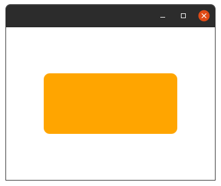
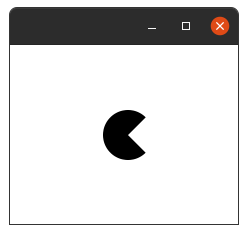
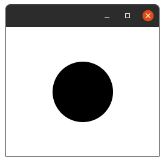
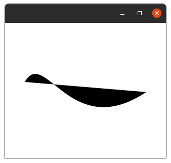
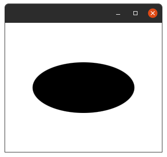

Rectangle.
---------

The Rectangle class defines a rectangle with the specified size and location.
By default, the rectangle has sharp corners.

Extensions    |    Property   |  Description
-------     |    -------    |   --------
`width` | `widthProperty()` | Defines the `width` of the rectangle.
`height` | `heightProperty()` | Defines the `height` of the rectangle.
`arcHeight` | `arcHeightProperty()` | Defines the vertical diameter of the arc at the four corners of the rectangle. The rectangle will have rounded corners if and only if both of the arc width and arc height properties are greater than `0.0`.
`arcWidth` | `arcWidthProperty()` | Defines the horizontal diameter of the arc at the four corners of the rectangle. The rectangle will have rounded corners if and only if both of the arc width and arc height properties are greater than `0.0`.
`x` | `xProperty()` | Defines the `X` coordinate of the upper-left corner of the rectangle.
`y` | `yProperty()` | Defines the `Y` coordinate of the upper-left corner of the rectangle.

**Example:**

```kotlin
class MainView: View() {
    override val root = stackpane {
        rectangle(10,10,220,100){
            fill=Color.ORANGE
            arcHeight=20.0
            arcWidth=20.0
        }
    }
}
```

**Output:**



Arc.
---
***

The Arc class represents a `2D` arc object, defined by a center point, 
start angle (in degrees), angular extent (length of the arc in degrees),

Extensions    |    Property   |  Description
-------     |    -------    |   --------
`type` | `typeProperty()` | Defines the closure type for the arc: `ArcType.OPEN`, `ArcType.CHORD`,or `ArcType.ROUND`, see the details next below.
`length` | `lengthProperty()` | Defines the angular extent of the arc in degrees.
`centerX` | `centerXProperty()` | Defines the `X` coordinate of the center point of the arc.
`centerY` | `centerYProperty()` | Defines the `Y` coordinate of the center point of the arc.
`radiusX` | `radiusXProperty()` | Defines the overall `width` (horizontal radius) of the full ellipse of which this arc is a partial section.
`radiusY` | `radiusYProperty()` | Defines the overall `height` (vertical radius) of the full ellipse of which this arc is a partial section.
`startAngle` | `startAngleProperty()` | Defines the starting angle of the arc in degrees.

>`ArcType.OPEN` The closure type for an open arc with no path segments connecting the two ends of the arc segment.

>`ArcType.CHORD` The closure type for an arc closed by drawing a straight line segment from the start of the arc segment to the end of the arc segment.
 
>`ArcType.ROUND` The closure type for an arc closed by drawing straight line segments from the start of the arc segment to the center of the full ellipse and from that point to the end of the arc segment.

**Example:**

```kotlin
class MainView:View() {
    override val root = stackpane {
        arc {
            centerX = 50.0
            centerY = 50.0
            radiusX = 25.0
            radiusY = 25.0
            startAngle = 45.0
            length = 270.0
            type = ArcType.ROUND
        }
    }
}
```

**Output:**



Circle.
------
******

The Circle class creates a new circle with the specified radius and center location measured in pixels Example usage. The following code creates a circle with radius 50px centered at (100,100)px.

Extensions    |    Property   |  Description
-------     |    -------    |   --------
`centerX` | `centerXProperty()` | Defines the horizontal position of the center of the circle in pixels.
`centerY` | `centerYProperty()` | Defines the vertical position of the center of the circle in pixels.
`radius` | `radiusProperty()` | Defines the radius of the circle in pixels.

**Example:**

```kotlin
class MainView:View() {
    override val root = stackpane {
        circle {
            centerX = 100.0
            centerY = 100.0
            radius = 50.0
        }
    }
}
```

**Output:**



CubiCurve.
---------
*********

The CubiCurve class defines a cubic Bézier parametric curve segment in `(x,y)` coordinate space. 
Drawing a curve that intersects both the specified coordinates `(startX, startY)` and `(endX, enfY)`, 
using the specified points `(controlX1, controlY1)` and `(controlX2, controlY2)` as Bézier control points.

Extensions    |    Property   |  Description
-------     |    -------    |   --------
`startX` | `startXProperty()` | the `X` coordinate of the start point
`startY` | `startYProperty()` | the `Y` coordinate of the start point
`controlX1` | `controlX1Property()` | Defines the `X` coordinate of the first control point of the cubic curve segment.
`controlY1` | `controlY1Property()` | Defines the `Y` coordinate of the first control point of the cubic curve segment.
`controlX2` | `controlX2Property()` | Defines the `X` coordinate of the second control point of the cubic curve segment.
`controlY2` | `controlY2Property()` | Defines the `Y` coordinate of the second control point of the cubic curve segment.
`endX` | `endXProperty()` | Defines the `X` coordinate of the end point of the cubic curve segment.
`endY` | `endYProperty()` | Defines the `Y` coordinate of the end point of the cubic curve segment.

```kotlin
class MainView: View() {
    override val root = stackpane {
        cubiccurve(10.0,80.0,50.0,10.0,100.0,200.0,250.0,100.0)
    }
}
```

**Output:**



Ellipse.
-------
*******

The Ellipse class creates a new ellipse with the specified size and location in pixels

Extensions    |    Property   |  Description
-------     |    -------    |   --------
`centerX` | `centerXProperty()` | Defines the horizontal position of the center of the ellipse in pixels.
`centerY` | `centerYProperty()` | Defines the vertical position of the center of the ellipse in pixels.
`radiusX` | `radiusXProperty()` | Defines the `width` of the ellipse in pixels.
`radiusY` | `radiusYProperty()` | Defines the `height` of the ellipse in pixels.

**Example:**

```kotlin
class MainView: View() {
    override val root = stackpane {
        ellipse(100.0,100.0,100.0,50.0)
    }
}
```

**Output:**




This Line represents a line segment in (x,y) coordinate space.

Extensions    |    Property   |  Description
-------     |    -------    |   --------
```kotlin
class MainView: View() {
    override val root = vbox {
        line {
            startX = 50.0
            startY = 50.0
            endX = 150.0
            endY = 100.0
        }
    }
}
```
Creates a polyline, defined by the array of the segment points. The Polyline class is similar to the Polygon class, except that it is not automatically closed.

Extensions    |    Property   |  Description
-------     |    -------    |   --------
```kotlin
class MainView: View() {
    override val root = vbox {
     polyline(0.0, 0.0, 80.0, 40.0, 40.0, 80.0){
         this.points
     }
    }
}
```
The Quadcurve class defines a quadratic Bézier parametric curve segment in (x,y) coordinate space. Drawing a curve that intersects both the specified coordinates (startX, startY) and (endX, enfY), using the specified point (controlX, controlY) as Bézier control point.

Extensions    |    Property   |  Description
-------     |    -------    |   --------
```kotlin
class MainView: View() {
    override val root = vbox {
        quadcurve {
            startX = 0.0
            startY = 150.0
            endX = 150.0
            endY = 150.0
            controlX = 75.0
            controlY = 0.0
        }
    }
}
```
The SVGPath class represents a simple shape that is constructed by parsing SVG path data from a String.

Extensions    |    Property   |  Description
-------     |    -------    |   --------
```kotlin
class MainView: View() {
    override val root = vbox {
        svgpath("M70,50 L90,50 L120,90 L150,50 L170,50 L210,90 L180,120 L170,110 L170,200 L70,200 L70,110 L60,120 L30,90 L70,50") {
            this.content
            this.fillRule
        }
    }
}
```
The Path class represents a simple shape and provides facilities required for basic construction and management of a geometric path.

Extensions    |    Property   |  Description
-------     |    -------    |   --------
```kotlin
class MainView: View() {
    override val root = vbox {
        path(){
            this.elements
            this.fillRule
            this.arcTo {  }
            this.closepath()
            this.hlineTo()
            this.lineTo()
            this.moveTo()
            this.vlineTo()
            this.quadqurveTo {  }
        }
    }
}
```
