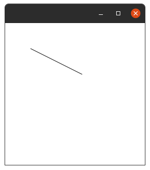
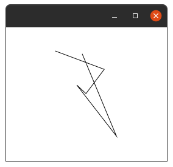
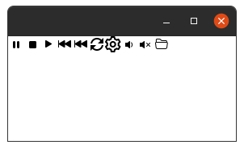
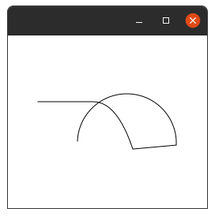

Rectangle.
---------

The Rectangle class defines a rectangle with the specified size and location.
By default, the rectangle has sharp corners.

Extensions    |    Property   |  Description
-------     |    -------    |   --------
`width` | `widthProperty()` | Defines the `width` of the rectangle.
`height` | `heightProperty()` | Defines the `height` of the rectangle.
`arcHeight` | `arcHeightProperty()` | Defines the vertical diameter of the arc at the four corners of the rectangle. The rectangle will have rounded corners if and only if both of the arc width and arc height properties are greater than `0.0`.
`arcWidth` | `arcWidthProperty()` | Defines the horizontal diameter of the arc at the four corners of the rectangle. The rectangle will have rounded corners if and only if both of the arc width and arc height properties are greater than `0.0`.
`x` | `xProperty()` | Defines the `X` coordinate of the upper-left corner of the rectangle.
`y` | `yProperty()` | Defines the `Y` coordinate of the upper-left corner of the rectangle.

**Example:**

```kotlin
class MainView: View() {
    override val root = stackpane {
        rectangle(10,10,220,100){
            fill=Color.ORANGE
            arcHeight=20.0
            arcWidth=20.0
        }
    }
}
```

**Output:**


Arc.
---
***

The Arc class represents a `2D` arc object, defined by a center point, 
start angle (in degrees), angular extent (length of the arc in degrees),

Extensions    |    Property   |  Description
-------     |    -------    |   --------
`type` | `typeProperty()` | Defines the closure type for the arc: `ArcType.OPEN`, `ArcType.CHORD`,or `ArcType.ROUND`, see the details next below.
`length` | `lengthProperty()` | Defines the angular extent of the arc in degrees.
`centerX` | `centerXProperty()` | Defines the `X` coordinate of the center point of the arc.
`centerY` | `centerYProperty()` | Defines the `Y` coordinate of the center point of the arc.
`radiusX` | `radiusXProperty()` | Defines the overall `width` (horizontal radius) of the full ellipse of which this arc is a partial section.
`radiusY` | `radiusYProperty()` | Defines the overall `height` (vertical radius) of the full ellipse of which this arc is a partial section.
`startAngle` | `startAngleProperty()` | Defines the starting angle of the arc in degrees.

>`ArcType.OPEN` The closure type for an open arc with no path segments connecting the two ends of the arc segment.

>`ArcType.CHORD` The closure type for an arc closed by drawing a straight line segment from the start of the arc segment to the end of the arc segment.
 
>`ArcType.ROUND` The closure type for an arc closed by drawing straight line segments from the start of the arc segment to the center of the full ellipse and from that point to the end of the arc segment.

**Example:**

```kotlin
class MainView:View() {
    override val root = stackpane {
        arc {
            centerX = 50.0
            centerY = 50.0
            radiusX = 25.0
            radiusY = 25.0
            startAngle = 45.0
            length = 270.0
            type = ArcType.ROUND
        }
    }
}
```

**Output:**


Circle.
------
******

The Circle class creates a new circle with the specified radius and center location measured in pixels Example usage. The following code creates a circle with radius 50px centered at (100,100)px.

Extensions    |    Property   |  Description
-------     |    -------    |   --------
`centerX` | `centerXProperty()` | Defines the horizontal position of the center of the circle in pixels.
`centerY` | `centerYProperty()` | Defines the vertical position of the center of the circle in pixels.
`radius` | `radiusProperty()` | Defines the radius of the circle in pixels.

**Example:**

```kotlin
class MainView:View() {
    override val root = stackpane {
        circle {
            centerX = 100.0
            centerY = 100.0
            radius = 50.0
        }
    }
}
```

**Output:**


CubiCurve.
---------
*********

The CubiCurve class defines a cubic Bézier parametric curve segment in `(x,y)` coordinate space. 
Drawing a curve that intersects both the specified coordinates `(startX, startY)` and `(endX, enfY)`, 
using the specified points `(controlX1, controlY1)` and `(controlX2, controlY2)` as Bézier control points.

Extensions    |    Property   |  Description
-------     |    -------    |   --------
`startX` | `startXProperty()` | the `X` coordinate of the start point
`startY` | `startYProperty()` | the `Y` coordinate of the start point
`controlX1` | `controlX1Property()` | Defines the `X` coordinate of the first control point of the cubic curve segment.
`controlY1` | `controlY1Property()` | Defines the `Y` coordinate of the first control point of the cubic curve segment.
`controlX2` | `controlX2Property()` | Defines the `X` coordinate of the second control point of the cubic curve segment.
`controlY2` | `controlY2Property()` | Defines the `Y` coordinate of the second control point of the cubic curve segment.
`endX` | `endXProperty()` | Defines the `X` coordinate of the end point of the cubic curve segment.
`endY` | `endYProperty()` | Defines the `Y` coordinate of the end point of the cubic curve segment.

```kotlin
class MainView: View() {
    override val root = stackpane {
        cubiccurve(10.0,80.0,50.0,10.0,100.0,200.0,250.0,100.0)
    }
}
```

**Output:**


Ellipse.
-------
*******

The Ellipse class creates a new ellipse with the specified size and location in pixels

Extensions    |    Property   |  Description
-------     |    -------    |   --------
`centerX` | `centerXProperty()` | Defines the horizontal position of the center of the ellipse in pixels.
`centerY` | `centerYProperty()` | Defines the vertical position of the center of the ellipse in pixels.
`radiusX` | `radiusXProperty()` | Defines the `width` of the ellipse in pixels.
`radiusY` | `radiusYProperty()` | Defines the `height` of the ellipse in pixels.

**Example:**

```kotlin
class MainView: View() {
    override val root = stackpane {
        ellipse(100.0,100.0,100.0,50.0)
    }
}
```

**Output:**


Line.
----
****

This Line represents a line segment in `(x,y)` coordinate space.

Extensions    |    Property   |  Description
-------     |    -------    |   --------
`startX` | `startXProperty()` | The `X` coordinate of the start point of the line segment.
`startY` | `startYProperty()` | The `Y` coordinate of the start point of the line segment.
`endX` | `endXProperty()` | The `X` coordinate of the end point of the line segment. 
`endY` | `endProperty()` | The `Y` coordinate of the end point of the line segment.

**Example:**

```kotlin
class MainView: View() {
    override val root = pane {
        setPrefSize(300.0,300.0)
        line (50.0,50.0,150.0,100.0)
    }
}
```

**Output:**



PolyLine.
--------
********

Creates a polyline, defined by the array of the segment points.
The `Polyline` class is similar to the `Polygon` class, except that it is not automatically closed.

Extensions    |    Property   |  Description
-------     |    -------    |   --------
`points` | Yes | **Returns:** An `observable` list of points constituting segments of this PolyLine

**Example:**

```kotlin
class MainView: View() {
    override val root = stackpane {
        polyline(0.0, 10.0, 80.0, 40.0, 50.0, 80.0,35.0,66.0,100.0,150.0,44.0,15.0)
    }
}
```

**Output:**



The Quadcurve class defines a quadratic Bézier parametric curve segment in `(x,y)` coordinate space. 
Drawing a curve that intersects both the specified coordinates `(startX, startY)` and `(endX, enfY)`,
using the specified point `(controlX, controlY)` as Bézier control point.

> For `Quadcurve` Extensions See `CubiCurve` Table.

```kotlin
class MainView: View() {
    override val root = stackpane {
        quadcurve (0.0,150.0,150.0,150.0,75.0,0.0)
    }
}
```

SVGPath.
-------
*******

The SVGPath class represents a simple shape that is constructed by parsing SVG path data from a `String`.

Extensions    |    Property   |  Description
-------     |    -------    |   --------
`content` | `contentProperty()` | Defines the SVG Path encoded string as specified at: [www.w3.org/TR/SVG/paths.html](http://www.w3.org/TR/SVG/paths.html)
`fillRule` | `fillRuleProperty()` | Defines the filling rule constant for determining the interior of the path. The value must be one of the following constants: `FillRile.EVEN_ODD` or `FillRule.NON_ZERO`. The default value is `FillRule.NON_ZERO`.

**Example:**

```kotlin
class MainView: View() {
    override val root = tilepane {
        list.forEach {
            svgpath(it)
        }
    }
}
```
```kotlin
private val list = listOf(
    "M5.5 3.5A1.5 1.5 0 0 1 7 5v6a1.5 1.5 0 0 1-3 0V5a1.5 1.5 0 0 1 1.5-1.5zm5 0A1.5 1.5 0 0 1 12 5v6a1.5 1.5 0 0 1-3 0V5a1.5 1.5 0 0 1 1.5-1.5z",
    "M5 3.5h6A1.5 1.5 0 0 1 12.5 5v6a1.5 1.5 0 0 1-1.5 1.5H5A1.5 1.5 0 0 1 3.5 11V5A1.5 1.5 0 0 1 5 3.5z",
    "M11.596 8.697l-6.363 3.692c-.54.313-1.233-.066-1.233-.697V4.308c0-.63.692-1.01 1.233-.696l6.363 3.692a.802.802 0 0 1 0 1.393z",
    "M.5 3.5A.5.5 0 0 0 0 4v8a.5.5 0 0 0 1 0V8.753l6.267 3.636c.54.313 1.233-.066 1.233-.697v-2.94l6.267 3.636c.54.314 1.233-.065 1.233-.696V4.308c0-.63-.693-1.01-1.233-.696L8.5 7.248v-2.94c0-.63-.692-1.01-1.233-.696L1 7.248V4a.5.5 0 0 0-.5-.5z",
    "M.5 3.5A.5.5 0 0 0 0 4v8a.5.5 0 0 0 1 0V8.753l6.267 3.636c.54.313 1.233-.066 1.233-.697v-2.94l6.267 3.636c.54.314 1.233-.065 1.233-.696V4.308c0-.63-.693-1.01-1.233-.696L8.5 7.248v-2.94c0-.63-.692-1.01-1.233-.696L1 7.248V4a.5.5 0 0 0-.5-.5z",
    "M4 20V13H11L7.783 16.22C8.89296 17.355 10.4125 17.9964 12 18C14.5394 17.9962 16.8015 16.3942 17.648 14H17.666C17.7805 13.6746 17.8672 13.3401 17.925 13H19.937C19.4331 16.9999 16.0315 19.9999 12 20H11.99C9.86876 20.0063 7.83316 19.1637 6.337 17.66L4 20ZM6.074 11H4.062C4.56575 7.0016 7.965 4.00213 11.995 3.99995H12C14.1216 3.99316 16.1577 4.83583 17.654 6.33999L20 3.99995V11H13L16.222 7.77999C15.1109 6.64364 13.5893 6.00213 12 5.99999C9.46055 6.00374 7.19848 7.60577 6.352 9.99999H6.334C6.21856 10.3251 6.13189 10.6597 6.075 11H6.074Z",
    "M13.8199 22H10.1799C9.71003 22 9.30347 21.673 9.20292 21.214L8.79592 19.33C8.25297 19.0921 7.73814 18.7946 7.26092 18.443L5.42392 19.028C4.97592 19.1709 4.48891 18.9823 4.25392 18.575L2.42992 15.424C2.19751 15.0165 2.27758 14.5025 2.62292 14.185L4.04792 12.885C3.98312 12.2961 3.98312 11.7019 4.04792 11.113L2.62292 9.816C2.27707 9.49837 2.19697 8.98372 2.42992 8.576L4.24992 5.423C4.48491 5.0157 4.97192 4.82714 5.41992 4.97L7.25692 5.555C7.50098 5.37416 7.75505 5.20722 8.01792 5.055C8.27026 4.91269 8.52995 4.78385 8.79592 4.669L9.20392 2.787C9.30399 2.32797 9.71011 2.00049 10.1799 2H13.8199C14.2897 2.00049 14.6958 2.32797 14.7959 2.787L15.2079 4.67C15.4887 4.79352 15.7622 4.93308 16.0269 5.088C16.2739 5.23081 16.5126 5.38739 16.7419 5.557L18.5799 4.972C19.0276 4.82967 19.514 5.01816 19.7489 5.425L21.5689 8.578C21.8013 8.98548 21.7213 9.49951 21.3759 9.817L19.9509 11.117C20.0157 11.7059 20.0157 12.3001 19.9509 12.889L21.3759 14.189C21.7213 14.5065 21.8013 15.0205 21.5689 15.428L19.7489 18.581C19.514 18.9878 19.0276 19.1763 18.5799 19.034L16.7419 18.449C16.5093 18.6203 16.2677 18.7789 16.0179 18.924C15.7557 19.0759 15.4853 19.2131 15.2079 19.335L14.7959 21.214C14.6954 21.6726 14.2894 21.9996 13.8199 22ZM7.61992 16.229L8.43992 16.829C8.62477 16.9652 8.81743 17.0904 9.01692 17.204C9.20462 17.3127 9.39788 17.4115 9.59592 17.5L10.5289 17.909L10.9859 20H13.0159L13.4729 17.908L14.4059 17.499C14.8132 17.3194 15.1998 17.0961 15.5589 16.833L16.3799 16.233L18.4209 16.883L19.4359 15.125L17.8529 13.682L17.9649 12.67C18.0141 12.2274 18.0141 11.7806 17.9649 11.338L17.8529 10.326L19.4369 8.88L18.4209 7.121L16.3799 7.771L15.5589 7.171C15.1997 6.90671 14.8132 6.68175 14.4059 6.5L13.4729 6.091L13.0159 4H10.9859L10.5269 6.092L9.59592 6.5C9.39772 6.58704 9.20444 6.68486 9.01692 6.793C8.81866 6.90633 8.62701 7.03086 8.44292 7.166L7.62192 7.766L5.58192 7.116L4.56492 8.88L6.14792 10.321L6.03592 11.334C5.98672 11.7766 5.98672 12.2234 6.03592 12.666L6.14792 13.678L4.56492 15.121L5.57992 16.879L7.61992 16.229ZM11.9959 16C9.78678 16 7.99592 14.2091 7.99592 12C7.99592 9.79086 9.78678 8 11.9959 8C14.2051 8 15.9959 9.79086 15.9959 12C15.9932 14.208 14.2039 15.9972 11.9959 16ZM11.9959 10C10.9033 10.0011 10.0138 10.8788 9.99815 11.9713C9.98249 13.0638 10.8465 13.9667 11.9386 13.9991C13.0307 14.0315 13.9468 13.1815 13.9959 12.09V12.49V12C13.9959 10.8954 13.1005 10 11.9959 10Z",
    "M9 4a.5.5 0 0 0-.812-.39L5.825 5.5H3.5A.5.5 0 0 0 3 6v4a.5.5 0 0 0 .5.5h2.325l2.363 1.89A.5.5 0 0 0 9 12V4zm3.025 4a4.486 4.486 0 0 1-1.318 3.182L10 10.475A3.489 3.489 0 0 0 11.025 8 3.49 3.49 0 0 0 10 5.525l.707-.707A4.486 4.486 0 0 1 12.025 8z",
    "M6.717 3.55A.5.5 0 0 1 7 4v8a.5.5 0 0 1-.812.39L3.825 10.5H1.5A.5.5 0 0 1 1 10V6a.5.5 0 0 1 .5-.5h2.325l2.363-1.89a.5.5 0 0 1 .529-.06zm7.137 2.096a.5.5 0 0 1 0 .708L12.207 8l1.647 1.646a.5.5 0 0 1-.708.708L11.5 8.707l-1.646 1.647a.5.5 0 0 1-.708-.708L10.793 8 9.146 6.354a.5.5 0 1 1 .708-.708L11.5 7.293l1.646-1.647a.5.5 0 0 1 .708 0z",
    "M1 3.5A1.5 1.5 0 0 1 2.5 2h2.764c.958 0 1.76.56 2.311 1.184C7.985 3.648 8.48 4 9 4h4.5A1.5 1.5 0 0 1 15 5.5v.64c.57.265.94.876.856 1.546l-.64 5.124A2.5 2.5 0 0 1 12.733 15H3.266a2.5 2.5 0 0 1-2.481-2.19l-.64-5.124A1.5 1.5 0 0 1 1 6.14V3.5zM2 6h12v-.5a.5.5 0 0 0-.5-.5H9c-.964 0-1.71-.629-2.174-1.154C6.374 3.334 5.82 3 5.264 3H2.5a.5.5 0 0 0-.5.5V6zm-.367 1a.5.5 0 0 0-.496.562l.64 5.124A1.5 1.5 0 0 0 3.266 14h9.468a1.5 1.5 0 0 0 1.489-1.314l.64-5.124A.5.5 0 0 0 14.367 7H1.633z",
)
```

**Output:**



Path.
----
****

The Path class represents a simple shape and provides facilities required for basic construction and management of a geometric path.

Extensions    |    Property   |  Description
-------     |    -------    |   --------
`elements` | Yes | Gets `observable` list of path elements of this path.
`arcTo{}` | No | ...
`closepath()` | No | ...
`hlineTo()` | No | ...
`lineTo()` | No | ...
`moveTo()` | No | ...
`vlineTo()` | No | ...
`quadqurveTo{}` | No | ...

**Example:**

```kotlin
class MainView: View() {
    override val root = stackpane {
        moveTo(0.0, 0.0)
        hlineTo(70.0)
        quadqurveTo {
            x = 120.0
            y = 60.0
            controlX = 100.0
            controlY = 0.0
        }
        lineTo(175.0, 55.0)
        arcTo {
            x = 50.0
            y = 50.0
            radiusX = 50.0
            radiusY = 50.0
        }
    }
}
```

**Output:**

