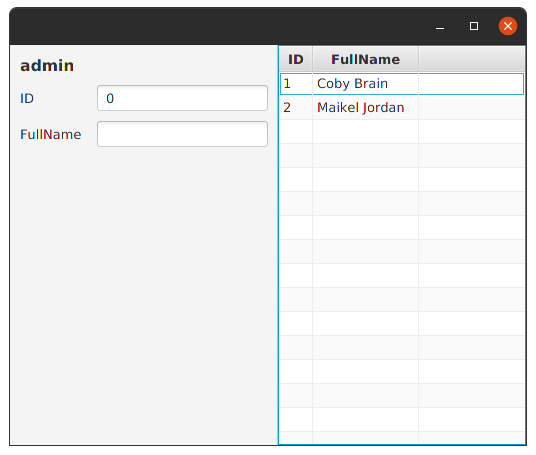

TableView.
---------

The TableView control is designed to visualize an unlimited number of rows of data, broken out into columns. 
A TableView is therefore very similar to the ListView control, with the addition of support for columns.

Extensions    |    Property   |  Description
-------     |    -------    |   --------
`items` | `itemsProperty()` | The underlying data model for the `TableView`. _*Note* that it has a generic type that must match the type of the `TableView` itself.
`columns` | Yes | The `TableColumns` that are part of this `TableView`. As the user reorders the `TableView` columns, this list will be updated to reflect the current visual ordering.
`columnResizePolicy` | `columnResizePolicyProperty()` | This is the function called when the user completes a column-resize operation.
`comparator` | `comparatorProperty()` | The comparator property is a read-only property that is representative of the current state of the sort order list. The sort order list contains the columns that have been added to it either programmatically or via a user clicking on the headers themselves.
`editingCell` | `editingCellProperty()` | Represents the current cell being edited, or null if there is no cell being edited.
`fixedCellSize` | `fixedCellSizeProperty()` | **Returns** the fixed cell size value. A value less than or equal to zero is used to represent that fixed cell size mode is disabled, and a value greater than zero represents the size of all cells in this control.
`focusModel` | `focusModelProperty()` | Represents the currently-installed `TableView.TableViewFocusModel` for this `TableView`. Under almost all circumstances leaving this as the default focus model will suffice.
`isEditable` | `editableProperty()` | Specifies whether this `TableView` is editable - only if the TableView, the `TableColumn` (if applicable) and the `TableCells` within it are both editable will a `TableCell` be able to go into their editing state.
`isTableMenuButtonVisible` | `tableMenuButtonVisibleProperty()` | This controls whether a menu button is available when the user clicks in a designated space within the `TableView`, within which is a radio menu item for each `TableColumn` in this table. This menu allows for the user to show and hide all `TableColumns` easily.
`onScrollTo` | `onScrollToProperty()` | Called when there's a request to scroll an index into view using `scrollTo(int)` or `scrollTo(Object)`, Check Also: `setOnScrollTo{}`.
`onScrollToColumn` | `onScrollToColumnProperty()` | Called when there's a request to scroll a column into view using `scrollToColumn(TableColumn)` or `scrollToColumnIndex(int)`, Check Also: `setOnScrollToColumn{}`.
`onSort` | `onSortProperty()` | Called when there's a request to sort the control, Check Also: `setOnSort{}`.
`placeholder` | `placeholderProperty()` | This Node is shown to the user when the table has no content to show. This may be the case because the table model has no data in the first place, that a filter has been applied to the table model, resulting in there being nothing to show the user, or that there are no currently visible columns.
`rowFactory` | `rowFactoryProperty()` | A function which produces a `TableRow`. The system is responsible for reusing `TableRows`. **Return** from this function a TableRow which might be usable for representing a single row in a `TableView`, Check Also: `setRowFactory{}`.
`selectionModel` | `selectionModelProperty()` | The SelectionModel provides the API through which it is possible to select single or multiple items within a `TableView`, as well as inspect which items have been selected by the user.
`selectedCell` | No | ...
`selectedColumn` | No | ...
`selectedValue` | No | ...
`selectedItem` | No | ...
`sortOrder` | Yes | The `sortOrder` list defines the order in which `TableColumn` instances are sorted. An empty `sortOrder` list means that no sorting is being applied on the `TableView`.
`sortPolicy` | `sortPolicyProperty()` | The sort policy specifies how sorting in this `TableView` should be performed. For example, a basic sort policy may just call `FXCollections.sort(tableView.getItems())`, whereas a more advanced sort policy may call to a database to perform the necessary sorting on the server-side, Check Also: `setSortPolicy{}`
`visibleLeafColumns` | Yes | **Returns** an unmodifiable list containing the currently visible leaf columns.
`editModel` | No | ... 
`columnIndexSelections` | No | ... 
`itemSelections` | No | ... 
`rowIndexSelections` | No | ... 
`getVisibleLeafColumn()`| No | **Returns** the `TableColumn` in the given column index, relative to all other visible leaf columns.
`sort()` | No | The sort method forces the `TableView` to re-run its sorting algorithm. More often than not it is not necessary to call this method directly, as it is automatically called when the sort order, sort policy, or the state of the TableColumn sort type properties change. In other words, this method should only be called directly when something external changes and a sort is required.
`edit()` | No | Causes the cell at the given `row/column` view indexes to switch into its editing state, if it is not already in it, and assuming that the `TableView` and column are also editable.
`getVisibleLeafIndex()` | No | **Returns** the position of the given column, relative to all other visible leaf columns.
`column()` | No | ...
`readonlyColumn()` | No | ...
`refresh()` | No | Calling `refresh()` forces the `TableView` control to recreate and repopulate the cells necessary to populate the visual bounds of the control. In other words, this forces the `TableView` to update what it is showing to the user. This is useful in cases where the underlying data source has changed in a way that is not observed by the `TableView` itself.
`resizeColumn()` | No | Applies the currently installed resize policy against the given column, resizing it based on the delta value provided.
`scrollTo()` | No | Scrolls the `TableView` so that the given `index/object` is visible within the viewport.
`scrollToColumn()` | No | Scrolls the `TableView` so that the given column is visible within the viewport. **Params:** `column` – The column that should be visible to the user.
`scrollToColumnIndex()` | No | Scrolls the `TableView` so that the given index is visible within the viewport. **Params:** `columnIndex` – The index of a column that should be visible to the user.
`bindSelected()` | No | ...
`addColumnInternal()` | No | ...
`enableCellEditing()` | No | ...
`enableDirtyTracking()` | No | ...
`makeIndexColumn()` | No | ...
`nestedColumn()` | No | ...
`onEditCommit{}` | No | ...
`rowExpander{}` | No | ...
`selectOnDrag()` | No | ...
`asyncItems{}` | No | ...
`moveToBottomWhere{}` | No | ...
`moveToTopWhere{}` | No | ...
`multiSelect()` | No | ...
`selectFirst()` | No | ...
`selectWhere{}` | No | ...
`onUserSelect{}` | No | ...
`onSelectionChange{}` | No | ...
`regainFocusAfterEdit()` | No | ...

**Example:**

```kotlin
class MainView:View() {
    val model = UserModel(User())
    var userTable: TableView<User> by singleAssign()
    val list = listOf(
        User(1, "Coby Brain"),
        User(2, "Maikel Jordan")
    ).observable()
    override val root = borderpane {
        right {
            userTable = tableview(list) {
                multiSelect(true)
                readonlyColumn("ID", User::id)
                column("FullName", User::fullName)
                model.rebindOnChange(this) {
                    item = it ?: User()
                }
            }
        }
        left {
            form {
                fieldset("admin") {
                    field("ID") {
                        textfield(model.bindid) {
                        }
                    }
                    field("FullName") {
                        textfield(model.bindfullname) { }
                    }
                }
            }
        }
    }
}
```
```kotlin
class User(id:Int=0,fullName:String?=null){
     val simpleIdProperty = SimpleIntegerProperty(id)
    var id by simpleIdProperty
     val simpleFullNameProperty = SimpleStringProperty(fullName)
    var fullName: String by simpleFullNameProperty
}
```
```kotlin
class UserModel(user:User?):ItemViewModel<User>(user) {
  val bindid = bind(User::simpleIdProperty)
  val bindfullname = bind(User::simpleFullNameProperty)
}
```

**Output:**



TreeTableView.
-------------
*************

The TreeTableView control is designed to visualize an unlimited number of rows of data, broken out into columns.
The `TreeTableView` control is conceptually very similar to the `TreeView` and `TableView` controls, and as you read on you'll come to see the **APIs** are largely the same.
However, to give a **high-level** overview, you'll note that the `TreeTableView` uses the same `TreeItem` **API** as `TreeView`, and that you therefore are required to simply set the `root` node in the `TreeTableView`.
Similarly, the `TreeTableView` control makes use of the same TableColumn-based approach that the `TableView` control uses, except instead of using the TableView-specific `TableColumn` class, you should instead use the TreeTableView-specific `TreeTableColumn` class instead.
For an example on how to create a `TreeTableView` instance, refer to the Creating a `TreeTableView` control section below.

* Powerful `TreeTableColumn` **API**:
  * Support for cell factories to easily customize cell contents in both rendering and editing states.
  * Specification of `minWidth`/ `prefWidth`/ `maxWidth`, and also fixed width columns.
  * Width resizing by the user at runtime.
  * Column reordering by the user at runtime.
  * Built-in support for column nesting
* Different resizing policies to dictate what happens when the user resizes columns.
* Support for multiple column sorting by clicking the column header (hold down Shift keyboard key whilst clicking on a header to sort by multiple columns)
    
Extensions    |    Property   |  Description
-------     |    -------    |   --------
`root` | `rootProperty()` | **Returns** the current root node of this `TreeTableView`, or null if no root node is specified.
`columns` | Yes | The `TreeTableColumns` that are part of this `TableView`. As the user reorders the `TableView` columns, this list will be updated to reflect the current visual ordering.
`columnResizePolicy` | `columnResizePolicyProperty()` | This is the function called when the user completes a column-resize operation. The two most common policies are available as static functions in the `TableView` class: `UNCONSTRAINED_RESIZE_POLICY` and `CONSTRAINED_RESIZE_POLICY`.
`comparator` | `comparatorProperty()` | The comparator property is a **read-only** property that is representative of the current state of the sort order list. The sort order list contains the columns that have been added to it either programmatically or via a user clicking on the headers themselves.
`editingCell` | `editingCellProperty()` | Represents the current cell being edited, or null if there is no cell being edited.
`isEditable` | `editableProperty()` | Specifies whether this `TreeTableView` is editable - only if the `TreeTableView` and the TreeCells within it are both editable will a TreeCell be able to go into their editing state.
`expandedItemCount` | `expandedItemCountProperty()` | Represents the number of tree nodes presently able to be visible in the `TreeTableView`. This is essentially the count of all expanded tree items, and their children.
`fixedCellSize` | `fixedCellSizeProperty()` | **Returns** the fixed cell size value. A value less than or equal to zero is used to represent that fixed cell size mode is disabled, and a value greater than zero represents the size of all cells in this control.
`focusModel` | `focusModelProperty()` | **Returns** the currently installed `FocusModel`.
`isShowRoot` | `showRootProperty()` | **Returns** true if the root of the `TreeTableView` should be shown, and `false` if it should not. By default, the root `TreeItem` is visible in the `TreeTableView`.
`isTableMenuButtonVisible` | `tableMenuButtonVisibleProperty()` | This controls whether a menu button is available when the user clicks in a designated space within the `TableView`, within which is a radio menu item for each `TreeTableColumn` in this table. This menu allows for the user to show and hide all `TreeTableColumns` easily.
`onScrollTo` | `onScrollToProperty()` | Called when there's a request to scroll an index into view using `scrollTo(int)`
`onScrollToColumn` | `onScrollToColumnProperty()` | Called when there's a request to scroll a column into view using `scrollToColumn(TreeTableColumn)` or `scrollToColumnIndex(int)`
`placeholder` | `placeholderProperty()` | This `Node` is shown to the user when the table has no content to show. This may be the case because the table model has no data in the first place, that a filter has been applied to the table model, resulting in there being nothing to show the user, or that there are no currently visible columns.
`onSort` | `onSortProperty()` | Called when there's a request to sort the control.
`rowFactory` | `rowFactoryProperty()` | A function which produces a `TreeTableRow`. The system is responsible for reusing `TreeTableRows`. **Return** from this function a `TreeTableRow` which might be usable for representing a single row in a TableView, Check Also: `setRowFactory{}`
`selectionModel` | `selectionModelProperty()` | **Returns** the currently installed selection model.
`sortMode` | `sortModeProperty()` | Specifies the sort mode to use when sorting the contents of this `TreeTableView`, should any columns be specified in the sort order list.
`sortOrder` | Yes | The `sortOrder` list defines the order in which `TreeTableColumn` instances are sorted. An empty `sortOrder` list means that no sorting is being applied on the `TableView`. If the `sortOrder` list has one `TreeTableColumn` within it, the `TableView` will be sorted using the `sortType` and comparator properties of this `TreeTableColumn` (assuming `TreeTableColumn.sortable` is `true`).
`sortPolicy` | `sortPolicyProperty()` | The sort policy specifies how sorting in this `TreeTableView` should be performed. For example, a basic sort policy may just recursively sort the children of the root tree item, whereas a more advanced sort policy may call to a database to perform the necessary sorting on the server-side, Check Also: `setSortPolicy{}`
`treeColumn` | `treeColumnProperty()` | Property that represents which column should have the disclosure node shown in it (that is, the column with the arrow). By default this will be the left-most column if this property is null, otherwise it will be the specified column assuming it is non-null and contained within the visible leaf columns list.
`visibleLeafColumns` | Yes | **Returns** an unmodifiable list containing the currently visible leaf columns, Check Also: `getVisibleLeafColumn()`.
`edit()` | No | Causes the cell at the given `row/column` view indexes to switch into its editing state, if it is not already in it, and assuming that the `TableView` and column are also editable.
`column()` | No | ...
`selectedCell` | No | ...
`selectedColumn` | No | ...
`selectedItem` | No | ...
`selectedValue` | No | ...
`getRow()` | No | **Returns** the index position of the given `TreeItem`, assuming that it is currently accessible through the tree hierarchy (most notably, that all parent tree items are expanded). If a parent tree item is collapsed, the result is that this method will return `-1` to indicate that the given tree item is not accessible in the tree. **Params:** item – The `TreeItem` for which the index is sought.
`sort()` | No | The sort method forces the `TreeTableView` to re-run its sorting algorithm. More often than not it is not necessary to call this method directly, as it is automatically called when the sort order, sort policy, or the state of the TreeTableColumn sort type properties change.
`getTreeItem()` | No | **Returns** the `TreeItem` in the given index, or null if it is out of bounds. **Params:** row – The index of the `TreeItem` being sought.
`getTreeItemLevel()` | No | Returns the number of levels of 'indentation' of the given `TreeItem`, based on how many times `getParent()` can be recursively called. If the given `TreeItem` is the root node of this `TreeTableView`, or if the `TreeItem` does not have any parent set, the returned value will be zero. For each time `getParent()` is recursively called, the returned value is incremented by one. **Params:** node – The `TreeItem` for which the level is needed.
`refresh()` | No | Calling `refresh()` forces the `TreeTableView` control to recreate and repopulate the cells necessary to populate the visual bounds of the control. In other words, this forces the `TreeTableView` to update what it is showing to the user. This is useful in cases where the underlying data source has changed in a way that is not observed by the `TreeTableView` itself.
`resizeColumn()` | No | Applies the currently installed resize policy against the given column, resizing it based on the delta value provided.
`scrollTo()` | No | Scrolls the `TreeTableView` such that the item in the given index is visible to the end user. **Params:** index – The index that should be made visible to the user, assuming of course that it is greater than, or equal to `0`, and less than the number of the visible items in the `TreeTableView`.
`scrollToColumn()` | No | Scrolls the `TreeTableView` so that the given column is visible within the viewport. **Params:** column – The column that should be visible to the user.
`scrollToColumnIndex()` | No | Scrolls the `TreeTableView` so that the given column is visible within the viewport. Params: column – The column that should be visible to the user.
`selectFirst()` | No | ...
`addColumnInternal()` | No | ...
`bindSelected()` | No | ...
`nestedColumn()` | No | ...
`onUserSelect()` | No | ...
`populate()` | No | ...
`resizeColumnsToFitContent()` | No | ...
`multiSelect()` | No | ...

```kotlin

``` 